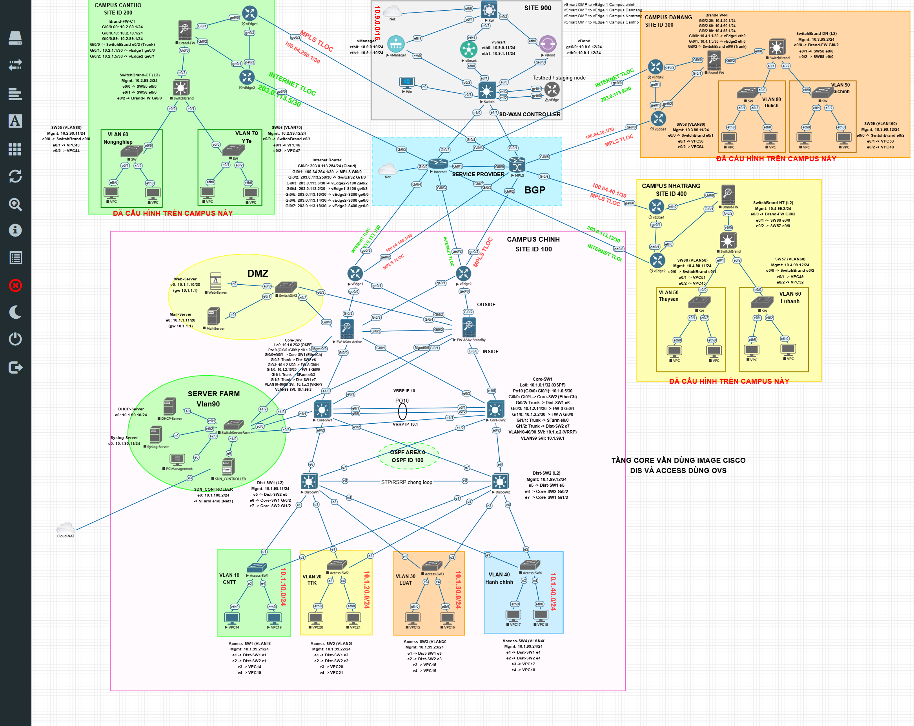
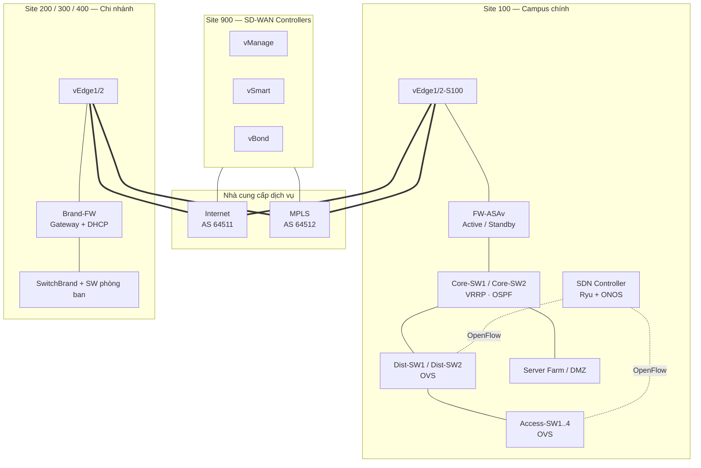

<div align="center">

# Xây dựng mạng Campus Network sử dụng SDN và SD-WAN

**Mô phỏng hạ tầng mạng đại học đa cơ sở trên EVE-NG — Campus LAN do SDN điều khiển, kết nối liên chi nhánh bằng SD-WAN overlay**


</div>

---

## Mục lục

- [Giới thiệu](#giới-thiệu)
- [Tính năng chính](#tính-năng-chính)
- [Kiến trúc hệ thống](#kiến-trúc-hệ-thống)
- [Quy hoạch địa chỉ](#quy-hoạch-địa-chỉ)
- [Công nghệ sử dụng](#công-nghệ-sử-dụng)
- [Cấu trúc thư mục](#cấu-trúc-thư-mục)
- [Yêu cầu môi trường](#yêu-cầu-môi-trường)
- [Triển khai lab](#triển-khai-lab)
- [Kiểm thử và xác minh](#kiểm-thử-và-xác-minh)
- [Tiến độ dự án](#tiến-độ-dự-án)
- [Tài liệu liên quan](#tài-liệu-liên-quan)
- [Nhóm thực hiện](#nhóm-thực-hiện)

---

## Giới thiệu

Hạ tầng mạng của trường đại học phải phục vụ đồng thời nhiều khoa, phòng máy, khu hành chính, dịch vụ dùng chung và các cơ sở ở xa. Mạng truyền thống cấu hình thủ công trên từng thiết bị nên khó mở rộng, khó đồng bộ chính sách và xử lý sự cố chậm.

Đề tài xây dựng một mô hình **Campus Network kết hợp SDN và SD-WAN**, mô phỏng đầy đủ trên **EVE-NG** (67 node):

- **Campus chính (Site 100)** theo mô hình 3 lớp Core – Distribution – Access; lớp Distribution/Access là **Open vSwitch do SDN Controller điều khiển** qua OpenFlow 1.3.
- **3 chi nhánh** (Cần Thơ, Đà Nẵng, Nha Trang) theo mô hình *Firewall-as-Core* gọn nhẹ.
- **SD-WAN Cisco Viptela** kết nối các cơ sở qua 2 đường truyền **Internet** và **MPLS**, có SLA, định tuyến theo ứng dụng (AAR) và chính sách dữ liệu tập trung.

### Mục tiêu

1. Thiết kế kiến trúc Campus phân cấp, có dự phòng ở các lớp Core, Firewall và WAN.
2. Quy hoạch VLAN và địa chỉ IP thống nhất cho tất cả các site.
3. Quản lý tập trung lớp chuyển mạch Campus bằng SDN Controller.
4. Kết nối đa cơ sở bằng SD-WAN overlay mã hoá IPsec, chọn đường theo SLA.
5. Kiểm thử chức năng: DHCP, định tuyến liên VLAN và liên site, failover, dịch vụ nội bộ.

### Phạm vi

Đề tài dừng ở mức thiết kế logic và mô phỏng trên EVE-NG, chưa triển khai trên hạ tầng vật lý. Toàn bộ cấu hình thiết bị, script và tài liệu vận hành đều nằm trong repository này.

---

## Tính năng chính

| Nhóm | Tính năng |
|---|---|
| **SDN Campus** | Ryu (OpenFlow 1.3) điều khiển 6 OVS: học MAC theo VLAN, chống vòng L2 bằng cây chuyển tiếp do controller tính (OVS không chạy STP), tự chuyển sang đường dự phòng khi một Distribution switch hỏng |
| **Giám sát SDN** | App NOC trên Ryu thu PortStats (băng thông, tắc nghẽn, REST `/noc/*`, dashboard); ONOS 2.7 chạy song song làm GUI topology |
| **SD-WAN** | vManage / vSmart / vBond, 9 vEdge, 2 màu TLOC (`biz-internet`, `mpls`), BFD full-mesh, service VPN 1, SLA class + AAR + data policy |
| **Underlay WAN** | eBGP giữa vEdge và nhà cung cấp (Internet AS 64511, MPLS AS 64512) |
| **Dự phòng** | VRRP trên Core-SW1/2, ASAv Active/Standby failover, 2 vEdge và 2 transport mỗi site, Access dual-home lên 2 Distribution |
| **Bảo mật** | ASAv phân vùng inside/DMZ/Server Farm, OSPF Area 0 giữa FW và Core, VLAN quản trị 99 tách biệt, ASDM |
| **Dịch vụ** | DHCP (Windows Server 2012 R2 + relay), DNS `campus.internal`, Web HTTPS (Nginx), Mail (hMailServer), Syslog (Kiwi) |
| **Công cụ** | `campus_ping_tool.py`: đo latency/loss/jitter, batch report, kiểm thử failover SD-WAN và quản lý VLAN tự động |

---

## Kiến trúc hệ thống





### Các site

| Site | Vai trò | Thành phần chính |
|---|---|---|
| **100** | Campus chính | FW-ASAv HA, Core-SW1/2 (IOL), Dist-SW1/2 + Access-SW1–4 (OVS), SDN Controller, Server Farm, DMZ, 2 vEdge |
| **200** | Chi nhánh Cần Thơ | Brand-FW (ASAv), SwitchBrand, SW55/56, 2 vEdge |
| **300** | Chi nhánh Đà Nẵng | Brand-FW (ASAv), SwitchBrand, SW58/59, 2 vEdge |
| **400** | Chi nhánh Nha Trang | Brand-FW (ASAv), SwitchBrand, SW57/60, 2 vEdge |
| **900** | SD-WAN Controllers | vManage, vSmart, vBond, Switch32 (LAN controller), vEdge65 |
| **SP** | Nhà cung cấp | Router Internet, router MPLS |

Campus chính và chi nhánh cố ý dùng hai kiến trúc khác nhau. Campus chính cần phân lớp và dự phòng đầy đủ; chi nhánh nhỏ dùng firewall làm gateway và DHCP để giảm số thiết bị và điểm lỗi.

---

## Quy hoạch địa chỉ

**Quy ước:** `10.<site>.<vlan>.0/24`, trong đó octet thứ hai là site (1 = Campus chính, 2 = Cần Thơ, 3 = Đà Nẵng, 4 = Nha Trang, 9 = Controller). Gateway luôn là `.1`, máy chủ dùng `.10`/`.11`, DHCP cấp dải `.100–.199`.

### Campus chính (Site 100)

| VLAN | Tên | Subnet |
|---:|---|---|
| 10 | Khoa CNTT | `10.1.10.0/24` |
| 20 | Khoa Toán – Thống kê | `10.1.20.0/24` |
| 30 | Khoa Luật | `10.1.30.0/24` |
| 40 | Hành chính | `10.1.40.0/24` |
| 90 | Server Farm | `10.1.90.0/24` |
| 99 | Management (SDN control plane, ASDM) | `10.1.99.0/24` |
| — | DMZ | `10.1.1.0/28` |

### Chi nhánh

| Site | VLAN phòng ban | Subnet |
|---|---|---|
| 200 Cần Thơ | 60 Nông nghiệp, 70 Y tế | `10.2.60.0/24`, `10.2.70.0/24` |
| 300 Đà Nẵng | 80 Du lịch, 90 Tài chính | `10.3.80.0/24`, `10.3.90.0/24` |
| 400 Nha Trang | 50 Thủy sản, 60 Lữ hành | `10.4.50.0/24`, `10.4.60.0/24` |

Mỗi chi nhánh có thêm VLAN 99 để quản trị.

### WAN và SD-WAN

| Hạng mục | Giá trị |
|---|---|
| Transport Internet | `203.0.113.0/24` (màu `biz-internet`) |
| Transport MPLS | `100.64.x.x/30` (màu `mpls`) |
| System-IP vEdge | `10.200.<site>.x` (site 300/400/900 dùng octet `30`/`40`/`90`) |
| Controller LAN | `10.9.0.0/24`: vManage `.10`, vSmart `.11`, vBond `.12` |
| BGP ASN | Internet 64511, MPLS 64512; Site 100/200/300/400 = 65000/65010/65020/65030 |

Bảng đầy đủ nằm trong [`campus_network_sdn_sdwan.md`](campus_network_sdn_sdwan.md) và [`configs/README.md`](configs/README.md).

---

## Công nghệ sử dụng

| Thành phần | Công nghệ / phiên bản |
|---|---|
| Nền tảng mô phỏng | EVE-NG |
| SDN Controller | Ryu (OpenFlow 1.3), ONOS 2.7.0 |
| Switch SDN | Open vSwitch trên Ubuntu |
| SD-WAN | Cisco Viptela 20.10.1 (vManage, vSmart, vBond, vEdge) |
| Firewall | Cisco ASAv (failover Active/Standby, ASDM 7.20) |
| Core / chi nhánh L2 | Cisco IOL |
| Giao thức | OSPF Area 0, eBGP, VRRP, 802.1Q, OMP, BFD, IPsec, DTLS |
| Dịch vụ | Windows Server 2012 R2 (DHCP, DNS), Nginx, hMailServer, Kiwi Syslog |
| Công cụ & tài liệu | Python 3 (Tkinter, matplotlib, paramiko), Bash, systemd, LaTeX |

---

## Cấu trúc thư mục

```text
.
├── Campus Network SDN SD-WAN.unl     # File lab EVE-NG (67 node, config nhúng)
├── campus_network_sdn_sdwan.md       # Tài liệu thiết kế: topology, bảng IP/VLAN/link
├── configs/                          # Cấu hình từng thiết bị theo site
│   ├── 01-Site100-Campus/            # Core, FW, OVS scripts, app Ryu, systemd, dịch vụ
│   ├── 02-Site200-CanTho/
│   ├── 03-Site300-DaNang/
│   ├── 04-Site400-NhaTrang/
│   ├── 05-Site900-Controller/        # vManage, vSmart, vBond, Switch32/61, vEdge65
│   ├── 05-Site900-SDWAN-Controllers/ # Bản running-config đầy đủ của controller
│   ├── 06-ServiceProvider/           # Router Internet và MPLS (BGP)
│   └── README.md                     # Ánh xạ node-id, cách nạp config, thứ tự khởi động
├── HuongDan/                         # Hướng dẫn vận hành: ký cert vEdge, cài OVS, GUI...
├── Giai_thich_Tunnel_SD-WAN.md       # Giải thích cơ chế tunnel SD-WAN
├── EVE_HuongDan_KetNoi_ChoAI.md      # Hướng dẫn kết nối EVE-NG
├── campus_ping_tool.py               # Công cụ đo lường và kiểm thử mạng (GUI)
├── sdn_controller_startup.sh         # Script khởi động SDN Controller
├── BangTheoDoiTienDo.md              # Bảng theo dõi tiến độ
├── BAOCAO_DACNTT_LVT/                # Báo cáo đồ án (LaTeX)
├── Baocao27/                         # Báo cáo tiến độ
├── SlideTrinhBayDA/                  # Slide thuyết trình (LaTeX Beamer)
└── topology.png                      # Sơ đồ topology tổng thể
```

---

## Yêu cầu môi trường

- **EVE-NG** (Community hoặc Pro), khuyến nghị tối thiểu 16 vCPU và 64 GB RAM để chạy toàn bộ lab. Có thể bật từng site nếu tài nguyên hạn chế.
- **Image** (tự chuẩn bị, không đi kèm repo vì lý do bản quyền):
  - Cisco IOL (L2/L3), Cisco ASAv
  - Cisco Viptela 20.10.1: `vtmgmt`, `vtsmart`, `vtbond`, `vtedge`
  - Ubuntu có Open vSwitch và Ryu (template `linux-ubuntu-ovs-16p`)
  - Windows Server 2012 R2, Windows 7, Ubuntu 18.04 Desktop, VPCS
- **Máy trạm:** Python 3.8+ nếu dùng công cụ kiểm thử:

```bash
pip install matplotlib paramiko numpy
```

---

## Triển khai lab

1. **Nhập lab:** copy `Campus Network SDN SD-WAN.unl` vào `/opt/unetlab/labs/` trên EVE-NG và sửa quyền:
   ```bash
   /opt/unetlab/wrappers/unl_wrapper -a fixpermissions
   ```
2. **Nạp cấu hình:** 47 node đã có config nhúng trong `.unl`. Các node còn lại (Viptela controller, Windows, Linux/OVS) cấu hình theo file trong `configs/`. Chi tiết xem [`configs/README.md`](configs/README.md).
3. **Khởi động theo thứ tự:**
   1. Service Provider (Internet, MPLS) → Switch32/Switch61 → vManage, vSmart, vBond → các vEdge.
   2. Site 100: Core-SW1/2 → FW-ASAv → Server Farm/DMZ → SDN Controller → Dist/Access → PC.
   3. Chi nhánh: Brand-FW → SwitchBrand/SW → PC.
4. **SDN:** controller chạy `campus-ryu.service` (OpenFlow `6653`, REST `8080`) và ONOS (`6654`, GUI `8181`). OVS tự khôi phục cấu hình qua `campus-ovs-restore.service`.
5. **SD-WAN:** onboard vEdge (CSR → ký cert → whitelist trên cả 3 controller) theo [`HuongDan/cách ký và add vedge.md`](HuongDan/cách%20ký%20và%20add%20vedge.md).

---

## Kiểm thử và xác minh

| Hạng mục | Lệnh / cách kiểm tra | Kết quả mong đợi |
|---|---|---|
| SDN kết nối | `curl http://10.1.99.10:8080/stats/switches` | Đủ 6 DPID `{5, 8, 66, 68, 69, 70}` |
| DHCP Campus | `ip dhcp` trên VPC VLAN 10–40 | Nhận `10.1.<vlan>.1xx`, ping được gateway và liên VLAN |
| DHCP chi nhánh | `show dhcpd state` trên Brand-FW, `ip dhcp` trên VPC | Nhận `10.<site>.<vlan>.1xx` |
| Control plane SD-WAN | `show control connections` trên vEdge | vBond, vManage, vSmart đều Up |
| Data plane SD-WAN | `show bfd sessions`, `show omp routes` | BFD Up, có route service VPN 1 |
| Liên site | Ping VPC giữa Site 200/300/400 | Thông qua overlay |
| Failover WAN | `campus_ping_tool.py` → SD-WAN Failover Test | Đo RTO khi tắt một màu WAN |
| Dịch vụ | `https://www.campus.internal`, gửi/nhận mail | Truy cập được từ PC các site |

---

## Tiến độ dự án

- [x] Thiết kế topology, quy hoạch IP/VLAN/ASN
- [x] Core IOL, FW-ASAv HA + ASDM, OSPF FW ↔ Core, DMZ, Server Farm
- [x] SDN Campus: Ryu điều khiển 6 OVS, chống vòng L2, failover, tự khôi phục sau reboot
- [x] DHCP Campus end-to-end qua relay
- [x] ONOS chạy song song Ryu làm GUI và giám sát
- [x] SD-WAN: 3 controller, PKI, vEdge onboard, BGP underlay, BFD full-mesh
- [x] Service VPN 1, SLA/AAR/data policy, liên thông chi nhánh
- [x] Dịch vụ Web / Mail / DNS / Syslog
- [ ] Ma trận kiểm thử tích hợp đầy đủ (FW failover, mất controller, cold-start toàn lab)
- [ ] Hoàn thiện báo cáo, slide và video demo

Chi tiết xem [`BangTheoDoiTienDo.md`](BangTheoDoiTienDo.md).

---

## Tài liệu liên quan

| Tài liệu | Nội dung |
|---|---|
| [`campus_network_sdn_sdwan.md`](campus_network_sdn_sdwan.md) | Thiết kế chi tiết, bảng IP/VLAN/link |
| [`configs/README.md`](configs/README.md) | Ánh xạ node-id, cách nạp config, thứ tự khởi động |
| [`configs/01-Site100-Campus/README_NOC.md`](configs/01-Site100-Campus/README_NOC.md) | App giám sát NOC trên Ryu |
| [`Giai_thich_Tunnel_SD-WAN.md`](Giai_thich_Tunnel_SD-WAN.md) | Cơ chế tunnel, TLOC, BFD trong SD-WAN |
| [`HuongDan/`](HuongDan/) | Hướng dẫn cài OVS, ký cert vEdge, xem GUI vManage |
| [`BAOCAO_DACNTT_LVT/main.pdf`](BAOCAO_DACNTT_LVT/main.pdf) | Báo cáo đồ án |

---

## Nhóm thực hiện

| Họ tên | MSSV |
|---|---|
| **Trần Hữu Nhân** | `52300235` |
| **Nguyễn Nhật Hào** | `52300198` |

Đồ án thực hiện cho mục đích học tập và nghiên cứu. Các image Cisco và phần mềm thương mại không được phân phối kèm repository này.
