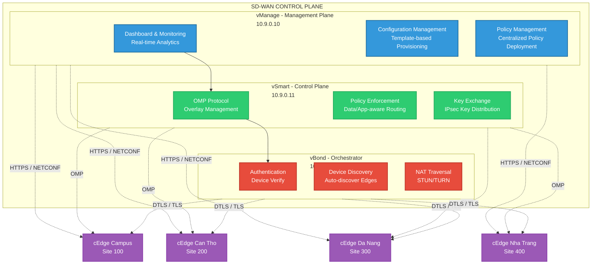
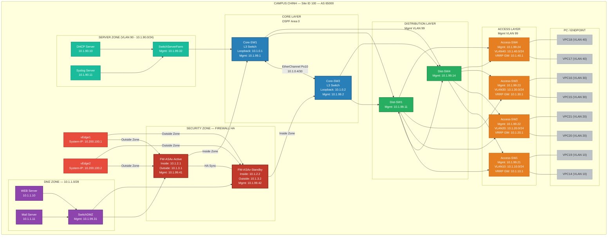

import os

md_content = """# Sơ Đồ Campus Network sử dụng SD-WAN

## Tổng quan kiến trúc

Dự án xây dựng Campus Network kết hợp **SD-WAN (Software-Defined Wide Area Network)** với các thành phần:

- **Campus chính (Site ID 100, AS 65000)**: Mô hình 3 lớp Core–Distribution–Access, với Firewall HA Pair bảo vệ LAN ↔ WAN và Server Farm/DMZ riêng biệt.
- **Chi nhánh Cần Thơ (Site ID 200, AS 65010)**: Có Branch Firewall, chia VLAN theo phòng ban (VLAN 60: Nông nghiệp, VLAN 70: Y Tế).
- **Chi nhánh Đà Nẵng (Site ID 300, AS 65020)**: Có Branch Firewall, chia VLAN theo phòng ban (VLAN 80: Du lịch, VLAN 90: Tài chính).
- **Chi nhánh Nha Trang (Site ID 400, AS 65030)**: Có Branch Firewall, chia VLAN theo phòng ban (VLAN 50: Thủy sản, VLAN 60: Lữ hành).
- **SD-WAN Controller Cluster (Site 900)**: vManage, vSmart, vBond (đặt tại Data Center hoặc Cloud).
- **Hạ tầng WAN**: Internet + MPLS qua Service Provider, IPsec SD-WAN Overlay.

---

## 1. Mermaid Code — Sơ Đồ Campus Network SD-WAN

> **Lưu ý**: Draw.io hỗ trợ import Mermaid. Vào **Extras > Edit Diagram** (hoặc **+ > Advanced > Mermaid**), dán code bên dưới.

### 1.1. Sơ đồ tổng thể (Top-Level Architecture)

```mermaid
flowchart TD

%% ================== SITE 100 - CAMPUS CHINH ==================
subgraph SITE100["CAMPUS CHINH - SITE ID 100 - AS 65000"]
    subgraph DMZ100["DMZ - 10.1.1.0/28"]
        S1_WEB["Web-Server<br/>10.1.1.10"]
        S1_MAIL["Mail-Server<br/>10.1.1.11"]
        S1_SWDMZ["SwitchDMZ<br/>Mgmt 10.1.99.31"]
    end
    subgraph SF100["SERVER FARM - VLAN90 10.1.90.0/24"]
        S1_DHCP["DHCP-Server<br/>10.1.90.10"]
        S1_SYSLOG["Syslog-Server<br/>10.1.90.11"]
        S1_SWSF["SwitchServerFarm<br/>Mgmt 10.1.99.32"]
    end
    S1_VE1["vEdge1<br/>System-IP 10.200.100.1"]
    S1_VE2["vEdge2<br/>System-IP 10.200.100.2"]
    S1_FWA["FW-ASAv-Active<br/>In:10.1.2.1 Out:10.1.3.1<br/>Mgmt:10.1.99.41"]
    S1_FWS["FW-ASAv-Standby<br/>In:10.1.2.2 Out:10.1.3.2<br/>Mgmt:10.1.99.42"]
    S1_C1["Core-SW1<br/>Loopback 10.1.0.1<br/>VRRP Active - Mgmt 10.1.99.1"]
    S1_C2["Core-SW2<br/>Loopback 10.1.0.2<br/>VRRP Standby - Mgmt 10.1.99.2"]
    S1_D1["Dist-SW1<br/>Mgmt 10.1.99.11 (thuan L2)"]
    S1_D4["Dist-SW4<br/>Mgmt 10.1.99.14 (thuan L2)"]
    S1_A1["Access-SW1<br/>VLAN10 CNTT 10.1.10.0/24<br/>VRRP GW 10.1.10.1<br/>Mgmt 10.1.99.21"]
    S1_A2["Access-SW2<br/>VLAN20 TTK 10.1.20.0/24<br/>VRRP GW 10.1.20.1<br/>Mgmt 10.1.99.22"]
    S1_A3["Access-SW3<br/>VLAN30 LUAT 10.1.30.0/24<br/>VRRP GW 10.1.30.1<br/>Mgmt 10.1.99.23"]
    S1_A4["Access-SW4<br/>VLAN40 HanhChinh 10.1.40.0/24<br/>VRRP GW 10.1.40.1<br/>Mgmt 10.1.99.24"]
    S1_VPC14["VPC14"]
    S1_VPC19["VPC19"]
    S1_VPC20["VPC20"]
    S1_VPC21["VPC21"]
    S1_VPC15["VPC15"]
    S1_VPC16["VPC16"]
    S1_VPC17["VPC17"]
    S1_VPC18["VPC18"]
end

%% ================== SITE 200 - CAMPUS CAN THO ==================
subgraph SITE200["CAMPUS CAN THO - SITE ID 200 - AS 65010"]
    S2_VE1["vEdge1<br/>System-IP 10.200.200.1"]
    S2_VE2["vEdge2<br/>System-IP 10.200.200.2"]
    S2_FW["Brand-FW<br/>Gateway (VLAN 60, 70) Out:10.2.1.1"]
    S2_SWB["SwitchBrand<br/>Mgmt 10.2.99.1"]
    S2_SWA["SW (VLAN 60 Nongnghi)<br/>Mgmt 10.2.99.11"]
    S2_SWB2["SW (VLAN 70 YTe)<br/>Mgmt 10.2.99.12"]
    S2_VPC1["VPC Nongnghi"]
    S2_VPC2["VPC Nongnghi"]
    S2_VPC3["VPC YTe"]
    S2_VPC4["VPC YTe"]
end

%% ================== SITE 300 - CAMPUS DA NANG ==================
subgraph SITE300["CAMPUS DA NANG - SITE ID 300 - AS 65020"]
    S3_VE1["vEdge1<br/>System-IP 10.200.300.1"]
    S3_VE2["vEdge2<br/>System-IP 10.200.300.2"]
    S3_FW["Brand-FW<br/>Gateway (VLAN 80, 90) Out:10.3.1.1"]
    S3_SWB["SwitchBrand<br/>Mgmt 10.3.99.1"]
    S3_SWA["SW (VLAN 80 Dulich)<br/>Mgmt 10.3.99.11"]
    S3_SWB2["SW (VLAN 90 Taichinh)<br/>Mgmt 10.3.99.12"]
    S3_VPC1["VPC Dulich"]
    S3_VPC2["VPC Dulich"]
    S3_VPC3["VPC Taichinh"]
    S3_VPC4["VPC Taichinh"]
end

%% ================== SITE 400 - CAMPUS NHA TRANG ==================
subgraph SITE400["CAMPUS NHA TRANG - SITE ID 400 - AS 65030"]
    S4_VE1["vEdge1<br/>System-IP 10.200.400.1"]
    S4_VE2["vEdge2<br/>System-IP 10.200.400.2"]
    S4_FW["Brand-FW<br/>Gateway (VLAN 50, 60) Out:10.4.1.1"]
    S4_SWB["SwitchBrand<br/>Mgmt 10.4.99.1"]
    S4_SWA["SW (VLAN 50 Thuysan)<br/>Mgmt 10.4.99.11"]
    S4_SWB2["SW (VLAN 60 Luhanh)<br/>Mgmt 10.4.99.12"]
    S4_VPC1["VPC Thuysan"]
    S4_VPC2["VPC Thuysan"]
    S4_VPC3["VPC Luhanh"]
    S4_VPC4["VPC Luhanh"]
end

%% ================== SD-WAN CONTROLLER ==================
subgraph CTRL["SD-WAN CONTROLLER - Site 900 - 10.9.0.0/16"]
    CTRL_SW1["Switch<br/>10.9.0.1"]
    CTRL_VMANAGE["vManager<br/>10.9.0.10"]
    CTRL_VSMART["vSmart<br/>10.9.0.11"]
    CTRL_VBOND["vBond<br/>10.9.0.12 (+public 203.0.113.100)"]
    CTRL_SW2["Switch<br/>10.9.0.2"]
    CTRL_WIN["Win<br/>10.9.0.20"]
end

%% ================== SERVICE PROVIDER ==================
subgraph SP["SERVICE PROVIDER - Underlay Transport"]
    SP_NET(("Net"))
    SP_INTERNET["Internet Router<br/>203.0.113.254"]
    SP_MPLS["MPLS Router<br/>100.64.255.254"]
end

%% ================== KET NOI SITE 100 ==================
S1_WEB --> S1_SWDMZ
S1_MAIL --> S1_SWDMZ
S1_SWDMZ --> S1_FWA
S1_SWDMZ --> S1_FWS
S1_VE1 --> S1_FWA
S1_VE1 --> S1_FWS
S1_VE2 --> S1_FWA
S1_VE2 --> S1_FWS
S1_FWA --> S1_C1
S1_FWA --> S1_C2
S1_FWS --> S1_C1
S1_FWS --> S1_C2
S1_C1 <--> S1_C2
S1_C1 --> S1_SWSF
S1_SWSF --> S1_DHCP
S1_SWSF --> S1_SYSLOG
S1_C1 --> S1_D1
S1_C1 --> S1_D4
S1_C2 --> S1_D1
S1_C2 --> S1_D4
S1_D1 <--> S1_D4
S1_D1 --> S1_A1
S1_D1 --> S1_A2
S1_D1 --> S1_A3
S1_D1 --> S1_A4
S1_D4 --> S1_A1
S1_D4 --> S1_A2
S1_D4 --> S1_A3
S1_D4 --> S1_A4
S1_A1 --> S1_VPC14
S1_A1 --> S1_VPC19
S1_A2 --> S1_VPC20
S1_A2 --> S1_VPC21
S1_A3 --> S1_VPC15
S1_A3 --> S1_VPC16
S1_A4 --> S1_VPC17
S1_A4 --> S1_VPC18

%% ================== KET NOI SITE 200 ==================
S2_VE1 <--> S2_VE2
S2_VE1 --> S2_FW
S2_FW --> S2_SWB
S2_SWB --> S2_SWA
S2_SWB --> S2_SWB2
S2_SWA --- S2_VPC1
S2_SWA --- S2_VPC2
S2_SWB2 --- S2_VPC3
S2_SWB2 --- S2_VPC4

%% ================== KET NOI SITE 300 ==================
S3_VE1 <--> S3_VE2
S3_VE1 --> S3_FW
S3_FW --> S3_SWB
S3_SWB --> S3_SWA
S3_SWB --> S3_SWB2
S3_SWA --- S3_VPC1
S3_SWA --- S3_VPC2
S3_SWB2 --- S3_VPC3
S3_SWB2 --- S3_VPC4

%% ================== KET NOI SITE 400 ==================
S4_VE1 <--> S4_VE2
S4_VE1 --> S4_FW
S4_FW --> S4_SWB
S4_SWB --> S4_SWA
S4_SWB --> S4_SWB2
S4_SWA --- S4_VPC1
S4_SWA --- S4_VPC2
S4_SWB2 --- S4_VPC3
S4_SWB2 --- S4_VPC4

%% ================== KET NOI SD-WAN CONTROLLER ==================
CTRL_SW1 --- CTRL_VMANAGE
CTRL_SW1 --- CTRL_VSMART
CTRL_SW1 --- CTRL_VBOND
CTRL_SW1 --- CTRL_SW2
CTRL_SW2 --- CTRL_WIN

%% ================== KET NOI SERVICE PROVIDER (UNDERLAY) ==================
SP_NET --- SP_INTERNET
SP_NET --- SP_MPLS
CTRL_SW2 --- SP_INTERNET
CTRL_SW2 --- SP_MPLS

S1_VE1 --> SP_INTERNET
S1_VE2 --> SP_MPLS
S2_VE1 --> SP_INTERNET
S2_VE2 --> SP_MPLS
S3_VE1 --> SP_INTERNET
S3_VE2 --> SP_MPLS
S4_VE1 --> SP_INTERNET
S4_VE2 --> SP_MPLS

%% ================== OMP CONTROL PLANE (dai dien) ==================
CTRL_VSMART -.->|"OMP"| S1_VE1
CTRL_VSMART -.->|"OMP"| S2_VE1
CTRL_VSMART -.->|"OMP"| S3_VE1
CTRL_VSMART -.->|"OMP"| S4_VE1

%% ================== MAU SAC ==================
classDef dmz fill:#FFF7C2,stroke:#B7950B,stroke-width:1px,color:#1F2937
classDef serverfarm fill:#D9F2CE,stroke:#4D8B31,stroke-width:1px,color:#1F2937
classDef fw fill:#FFD6D6,stroke:#C0392B,stroke-width:1px,color:#1F2937
classDef core fill:#DCEBFF,stroke:#2563EB,stroke-width:1px,color:#1F2937
classDef dist fill:#E4F3D9,stroke:#4D8B31,stroke-width:1px,color:#1F2937
classDef access fill:#FBE6C7,stroke:#B5762A,stroke-width:1px,color:#1F2937
classDef pcnode fill:#F0F0F0,stroke:#8A8A8A,stroke-width:1px,color:#1F2937
classDef sdwanedge fill:#FCE1EC,stroke:#C2255C,stroke-width:1px,color:#1F2937
classDef sdwanctrl fill:#E9E3FF,stroke:#7C3AED,stroke-width:1px,color:#1F2937
classDef sp fill:#DCEEF7,stroke:#2E86C1,stroke-width:1px,color:#1F2937

class S1_WEB,S1_MAIL,S1_SWDMZ dmz
class S1_DHCP,S1_SYSLOG,S1_SWSF serverfarm
class S1_FWA,S1_FWS,S2_FW,S3_FW,S4_FW fw
class S1_C1,S1_C2 core
class S1_D1,S1_D4 dist
class S1_A1,S1_A2,S1_A3,S1_A4 access
class S1_VPC14,S1_VPC19,S1_VPC20,S1_VPC21,S1_VPC15,S1_VPC16,S1_VPC17,S1_VPC18 pcnode
class S2_VPC1,S2_VPC2,S2_VPC3,S2_VPC4,S3_VPC1,S3_VPC2,S3_VPC3,S3_VPC4,S4_VPC1,S4_VPC2,S4_VPC3,S4_VPC4 pcnode
class S2_SWB,S2_SWA,S2_SWB2,S3_SWB,S3_SWA,S3_SWB2,S4_SWB,S4_SWA,S4_SWB2 dist
class S1_VE1,S1_VE2,S2_VE1,S2_VE2,S3_VE1,S3_VE2,S4_VE1,S4_VE2 sdwanedge
class CTRL_VMANAGE,CTRL_VSMART,CTRL_VBOND,CTRL_SW1,CTRL_SW2,CTRL_WIN sdwanctrl
class SP_INTERNET,SP_MPLS sp
```

---

### 1.2. Sơ đồ chi tiết SD-WAN Controller

---

### 1.3. Sơ đồ chi tiết Campus chính — 3 lớp Core/Distribution/Access + Firewall HA + DMZ

---

### 1.4. Sơ đồ chi tiết Chi nhánh Cần Thơ — Site ID 200 (Chia VLAN: Nông nghiệp, Y Tế)

---

### 1.5. Sơ đồ chi tiết Chi nhánh Đà Nẵng — Site ID 300 (Chia VLAN: Du lịch, Tài chính)

---

### 1.6. Sơ đồ chi tiết Chi nhánh Nha Trang — Site ID 400 (Chia VLAN: Thủy sản, Lữ hành)

---

## 2. Bảng Quy Hoạch Địa Chỉ IP

### 2.1. SD-WAN Controller (Site 900 — Cloud/DC riêng)

| Thành phần | Interface | IP Address | Subnet | Vai trò |
|---|---|---|---|---|
| **Switch (tầng trên)** | — | 10.9.0.1 | /16 | Aggregation, nối Net/vManager/vSmart/vBond |
| **vManager** | eth0 | 10.9.0.10 | /16 | Quản lý & cấu hình tập trung |
| **vSmart** | eth0 | 10.9.0.11 | /16 | Điều khiển định tuyến overlay (OMP) |
| **vBond** | eth0 | 10.9.0.12 | /16 | Xác thực & onboard Edge mới (+ public 203.0.113.100) |
| **Switch (tầng dưới)** | — | 10.9.0.2 | /16 | Nối xuống Service Provider + Win |
| **Win (Quản trị)** | eth0 | 10.9.0.20 | /16 | Máy quản trị truy cập vManager |

### 2.2. Network Services — Campus Chính

| Thành phần | Interface | IP Address | Subnet | Vai trò |
|---|---|---|---|---|
| **Web-Server** | eth0 | 10.1.1.10 | /28 | Web Server (Public) — DMZ |
| **Mail-Server** | eth0 | 10.1.1.11 | /28 | Mail Server — DMZ |
| **DHCP-Server** | eth0 | 10.1.90.10 | /24 | Server cấp IP động (VLAN 10/20/30/40) |
| **Syslog-Server** | eth0 | 10.1.90.11 | /24 | Centralized Logging |
| **SwitchDMZ** | Mgmt | 10.1.99.31 | /24 | L2 Switch khu DMZ (uplink kép tới FW) |
| **SwitchServerFarm** | Mgmt | 10.1.99.32 | /24 | L2 Switch khu Server Farm (uplink đơn tới Core1) |

### 2.3. Campus Chính — Site ID 100 (AS 65000)

| Thành phần | Interface | IP Address | Subnet | VLAN | Vai trò |
|---|---|---|---|---|---|
| **FW-ASAv-Active** | Outside | 10.1.3.1 | /29 | — | Segment ngoài (FW↔vEdge) |
| **FW-ASAv-Active** | Inside | 10.1.2.1 | /29 | — | Segment trong (FW↔Core) |
| **FW-ASAv-Active** | Mgmt | 10.1.99.41 | /24 | 99 | Quản lý riêng |
| **FW-ASAv-Standby**| Outside | 10.1.3.2 | /29 | — | Segment ngoài (FW↔vEdge) |
| **FW-ASAv-Standby**| Inside | 10.1.2.2 | /29 | — | Segment trong (FW↔Core) |
| **FW-ASAv-Standby**| Mgmt | 10.1.99.42 | /24 | 99 | Quản lý riêng |
| **Core-SW1** | Loopback0 | 10.1.0.1 | /32 | — | OSPF Router-ID |
| **Core-SW1** | Po10 | 10.1.0.5 | /30 | — | Port-Channel to Core-SW2 |
| **Core-SW1** | VLAN10 SVI | 10.1.10.2 | /24 | 10 | Real IP (VRRP VIP: 10.1.10.1) |
| **Core-SW1** | VLAN20 SVI | 10.1.20.2 | /24 | 20 | Real IP (VRRP VIP: 10.1.20.1) |
| **Core-SW1** | VLAN30 SVI | 10.1.30.2 | /24 | 30 | Real IP (VRRP VIP: 10.1.30.1) |
| **Core-SW1** | VLAN40 SVI | 10.1.40.2 | /24 | 40 | Real IP (VRRP VIP: 10.1.40.1) |
| **Core-SW1** | Mgmt | 10.1.99.1 | /24 | 99 | Quản lý Core1 |
| **Core-SW2** | Loopback0 | 10.1.0.2 | /32 | — | OSPF Router-ID |
| **Core-SW2** | Po10 | 10.1.0.6 | /30 | — | Port-Channel to Core-SW1 |
| **Core-SW2** | VLAN10 SVI | 10.1.10.3 | /24 | 10 | Backup IP |
| **Core-SW2** | VLAN20 SVI | 10.1.20.3 | /24 | 20 | Backup IP |
| **Core-SW2** | VLAN30 SVI | 10.1.30.3 | /24 | 30 | Backup IP |
| **Core-SW2** | VLAN40 SVI | 10.1.40.3 | /24 | 40 | Backup IP |
| **Core-SW2** | Mgmt | 10.1.99.2 | /24 | 99 | Quản lý Core2 |
| **Dist-SW1** | Mgmt | 10.1.99.11 | /24 | 99 | Switch Distribution 1 (Thuần L2) |
| **Dist-SW4** | Mgmt | 10.1.99.14 | /24 | 99 | Switch Distribution 4 (Thuần L2) |
| **Access-SW1** | Mgmt | 10.1.99.21 | /24 | 99 | Truy cập VLAN 10 — CNTT |
| **Access-SW2** | Mgmt | 10.1.99.22 | /24 | 99 | Truy cập VLAN 20 — TTK |
| **Access-SW3** | Mgmt | 10.1.99.23 | /24 | 99 | Truy cập VLAN 30 — LUẬT |
| **Access-SW4** | Mgmt | 10.1.99.24 | /24 | 99 | Truy cập VLAN 40 — Hành chính |

### 2.4. Campus Chính — VLAN & DHCP Pool

| VLAN ID | Tên VLAN | Mạng con | Gateway (VRRP VIP) | DHCP Range | Phân khu |
|---|---|---|---|---|---|
| **10** | Khoa CNTT | 10.1.10.0/24 | 10.1.10.1 | 10.1.10.100 – 10.1.10.200 | VPC14, VPC19 |
| **20** | Khoa Toán TK | 10.1.20.0/24 | 10.1.20.1 | 10.1.20.100 – 10.1.20.200 | VPC20, VPC21 |
| **30** | Khoa Luật | 10.1.30.0/24 | 10.1.30.1 | 10.1.30.100 – 10.1.30.200 | VPC15, VPC16 |
| **40** | Phòng HC | 10.1.40.0/24 | 10.1.40.1 | 10.1.40.100 – 10.1.40.200 | VPC17, VPC18 |
| **90** | Server Farm | 10.1.90.0/24 | 10.1.90.1 | Static IP | DHCP/Syslog Server |
| **99** | Management | 10.1.99.0/24 | — | — | Quản lý IP các Switch |

### 2.5. Chi nhánh Cần Thơ — Site ID 200 (AS 65010)

| Thành phần | Interface | IP Address | Subnet | Vai trò |
|---|---|---|---|---|
| **Brand-FW** | Inside (VLAN 60) | 10.2.60.1 | /24 | Gateway L3 cho Khoa Nông nghiệp |
| **Brand-FW** | Inside (VLAN 70) | 10.2.70.1 | /24 | Gateway L3 cho Khoa Y Tế |
| **Brand-FW** | Outside | 10.2.1.1 | /24 | Outside nối cEdge |
| **SwitchBrand** | Mgmt | 10.2.99.1 | /24 | Switch phân phối/Trunking (Thuần L2) |
| **SW-A (VLAN 60)**| Mgmt | 10.2.99.11 | /24 | Access Switch (Khoa Nông nghiệp) |
| **SW-B (VLAN 70)**| Mgmt | 10.2.99.12 | /24 | Access Switch (Khoa Y Tế) |

### 2.6. Chi nhánh Cần Thơ — DHCP & Mạng nội bộ

| VLAN ID | Tên VLAN | Mạng con | Gateway (Brand-FW) | DHCP Range | Phân khu |
|---|---|---|---|---|---|
| **60** | Khoa Nông nghiệp | 10.2.60.0/24 | 10.2.60.1 | 10.2.60.100 – 10.2.60.200 | VPC nhánh Nông nghiệp |
| **70** | Khoa Y Tế | 10.2.70.0/24 | 10.2.70.1 | 10.2.70.100 – 10.2.70.200 | VPC nhánh Y Tế |

### 2.7. Chi nhánh Đà Nẵng — Site ID 300 (AS 65020)

| Thành phần | Interface | IP Address | Subnet | Vai trò |
|---|---|---|---|---|
| **Brand-FW** | Inside (VLAN 80) | 10.3.80.1 | /24 | Gateway L3 cho Khoa Du lịch |
| **Brand-FW** | Inside (VLAN 90) | 10.3.90.1 | /24 | Gateway L3 cho Khoa Tài chính |
| **Brand-FW** | Outside | 10.3.1.1 | /24 | Outside nối cEdge |
| **SwitchBrand** | Mgmt | 10.3.99.1 | /24 | Switch phân phối/Trunking (Thuần L2) |
| **SW-A (VLAN 80)**| Mgmt | 10.3.99.11 | /24 | Access Switch (Khoa Du lịch) |
| **SW-B (VLAN 90)**| Mgmt | 10.3.99.12 | /24 | Access Switch (Khoa Tài chính) |

### 2.8. Chi nhánh Đà Nẵng — DHCP & Mạng nội bộ

| VLAN ID | Tên VLAN | Mạng con | Gateway (Brand-FW) | DHCP Range | Phân khu |
|---|---|---|---|---|---|
| **80** | Khoa Du lịch | 10.3.80.0/24 | 10.3.80.1 | 10.3.80.100 – 10.3.80.200 | VPC nhánh Du lịch |
| **90** | Khoa Tài chính | 10.3.90.0/24 | 10.3.90.1 | 10.3.90.100 – 10.3.90.200 | VPC nhánh Tài chính |

### 2.9. Chi nhánh Nha Trang — Site ID 400 (AS 65030)

| Thành phần | Interface | IP Address | Subnet | Vai trò |
|---|---|---|---|---|
| **Brand-FW** | Inside (VLAN 50) | 10.4.50.1 | /24 | Gateway L3 cho Khoa Thủy sản |
| **Brand-FW** | Inside (VLAN 60) | 10.4.60.1 | /24 | Gateway L3 cho Khoa Lữ hành |
| **Brand-FW** | Outside | 10.4.1.1 | /24 | Outside nối cEdge |
| **SwitchBrand** | Mgmt | 10.4.99.1 | /24 | Switch phân phối/Trunking (Thuần L2) |
| **SW-A (VLAN 50)**| Mgmt | 10.4.99.11 | /24 | Access Switch (Khoa Thủy sản) |
| **SW-B (VLAN 60)**| Mgmt | 10.4.99.12 | /24 | Access Switch (Khoa Lữ hành) |

### 2.10. Chi nhánh Nha Trang — DHCP & Mạng nội bộ

| VLAN ID | Tên VLAN | Mạng con | Gateway (Brand-FW) | DHCP Range | Phân khu |
|---|---|---|---|---|---|
| **50** | Khoa Thủy sản | 10.4.50.0/24 | 10.4.50.1 | 10.4.50.100 – 10.4.50.200 | VPC nhánh Thủy sản |
| **60** | Khoa Lữ hành | 10.4.60.0/24 | 10.4.60.1 | 10.4.60.100 – 10.4.60.200 | VPC nhánh Lữ hành |

### 2.11. Service Provider Transport & SD-WAN Edge (OMP / TLOC)

| Site | Thiết bị | System IP (OMP) | TLOC (Internet Underlay) | TLOC (MPLS Underlay) | Transit IP |
|---|---|---|---|---|---|
| Campus (100) | vEdge1 | 10.200.100.1 | 203.0.113.1/30 | — | — |
| Campus (100) | vEdge2 | 10.200.100.2 | — | 100.64.100.1/30 | — |
| Cần Thơ (200) | vEdge1 | 10.200.200.1 | 203.0.113.5/30 | — | 10.2.2.1/30 (với vEdge2) |
| Cần Thơ (200) | vEdge2 | 10.200.200.2 | — | 100.64.200.1/30 | 10.2.2.2/30 (với vEdge1) |
| Đà Nẵng (300) | vEdge1 | 10.200.300.1 | 203.0.113.9/30 | — | 10.3.2.1/30 (với vEdge2) |
| Đà Nẵng (300) | vEdge2 | 10.200.300.2 | — | 100.64.300.1/30 | 10.3.2.2/30 (với vEdge1) |
| Nha Trang (400)| vEdge1 | 10.200.400.1 | 203.0.113.13/30 | — | 10.4.2.1/30 (với vEdge2) |
| Nha Trang (400)| vEdge2 | 10.200.400.2 | — | 100.64.400.1/30 | 10.4.2.2/30 (với vEdge1) |

> **Lưu ý**: System IP định danh trên OMP, dạng Loopback. Không dùng làm LAN Gateway.

---

## 3. Chú thích Ký hiệu

| Ký hiệu | Ý nghĩa |
|---|---|
| **Đường liền màu đen/xám** | Kết nối LAN L2/L3 nội bộ |
| **Đường liền màu đỏ đậm** | Kết nối Firewall (Inside/Outside) |
| **Đường nét đứt** | Kết nối logic, OMP Control Plane hoặc Tunnel Overlay |
| **Nút đỏ đậm (fw class)** | Firewall-ASAv / Brand-FW |
| **Nút vàng nhạt (dmz class)** | DMZ Zone |
| **Nút cam (acc class)** | Access Switch |
| **Nút tím (edge class)** | SD-WAN vEdge Router |
| **Nút xanh nhạt (core class)** | Core Layer Switch |
| **Nút xám nhạt (pc class)** | End-host PC (VPC) |

---

## 4. Hướng dẫn Import vào Draw.io

1. Mở [draw.io](https://app.diagrams.net/)
2. Chọn **Extras > Edit Diagram** (hoặc **+ > Advanced > Mermaid**)
3. Copy code Mermaid của từng section và dán vào
4. Nhấn **Close** hoặc **Insert** để render
5. Điều chỉnh layout và kéo thả các node theo ý muốn

> **Tip**: Nên import từng section riêng (1.1 -> 1.6) để dễ sắp xếp layout trên draw.io. Sau đó ghép lại thành sơ đồ hoàn chỉnh.
