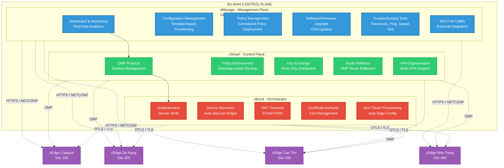
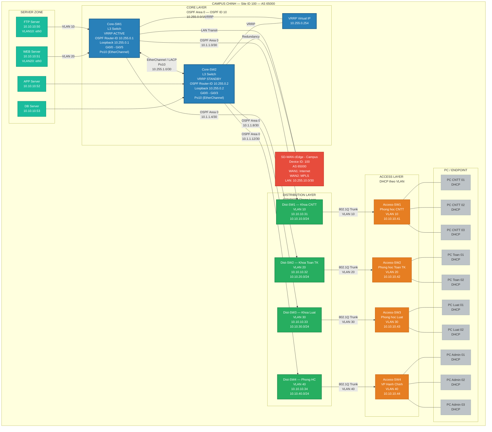
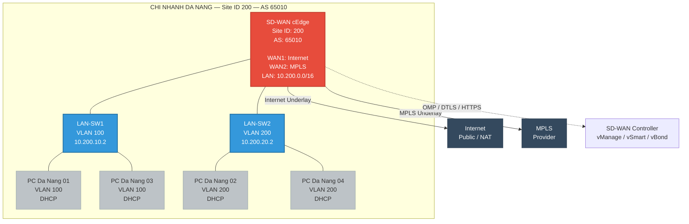
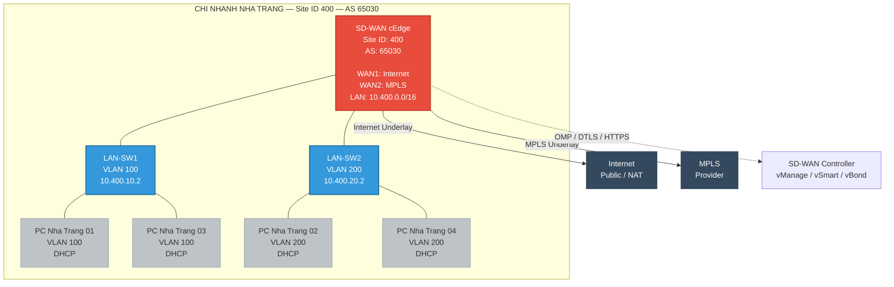

# Sơ Đồ Campus Network sử dụng SDN và SD-WAN

## Tổng quan kiến trúc

Dự án xây dựng Campus Network kết hợp **SDN (Software-Defined Networking)** và **SD-WAN (Software-Defined Wide Area Network)** với các thành phần:

- **SDN Controller Cluster**: 3 nodes (ONOS / OpenDaylight) — quản lý tập trung campus
- **Campus chính (Site ID 100, AS 65000)**: Mô hình 3 lớp Core–Distribution–Access
- **Chi nhánh Đà Nẵng (Site ID 200, AS 65010)**: Mô hình 2 lớp, kết nối SD-WAN
- **Chi nhánh Cần Thơ (Site ID 300, AS 65020)**: Mô hình 2 lớp, kết nối SD-WAN
- **Chi nhánh Nha Trang (Site ID 400, AS 65030)**: Mô hình 2 lớp, kết nối SD-WAN
- **SD-WAN Controller Cluster**: vManage, vSmart, vBond (đặt tại Data Center)
- **Hạ tầng WAN**: Internet + MPLS qua Service Provider, IPsec SD-WAN Overlay

---

## 1. Mermaid Code — Sơ Đồ Campus Network SDN + SD-WAN

> **Lưu ý**: Draw.io hỗ trợ import Mermaid. Vào **Extras > Edit Diagram**, dán code bên dưới.

### 1.1. Sơ đồ tổng thể (Top-Level Architecture)

```mermaid
graph TB
    %% =========================================================
    %% SDN CONTROLLER CLUSTER
    %% =========================================================
    subgraph SDN["SDN MANAGEMENT PLANE - CAMPUS SDN"]
        SDN1["SDN Controller 1<br/>ONOS / OpenDaylight<br/>10.10.10.11"]
        SDN2["SDN Controller 2<br/>ONOS / OpenDaylight<br/>10.10.10.12"]
        SDN3["SDN Controller 3<br/>ONOS / OpenDaylight<br/>10.10.10.13"]
        SDNCLUSTER["SDN CONTROLLER CLUSTER<br/><br/>Northbound API<br/>REST API / RESTCONF<br/><br/>Southbound API<br/>OpenFlow / NETCONF / RESTCONF<br/><br/>Centralized Network Management<br/>Topology Discovery<br/>Flow Management<br/>VLAN Management<br/>ACL / Policy<br/>Monitoring"]
        SDN1 --- SDNCLUSTER
        SDN2 --- SDNCLUSTER
        SDN3 --- SDNCLUSTER
    end

    %% =========================================================
    %% CAMPUS MAIN SITE
    %% =========================================================
    subgraph CAMPUS["CAMPUS CHÍNH - SITE ID 100 - AS 65000"]

        %% --- NETWORK SERVICES ---
        subgraph SERVICES["NETWORK SERVICES"]
            DHCP["DHCP SERVER<br/>10.10.10.20<br/><br/>DHCP VLAN 10<br/>DHCP VLAN 20<br/>DHCP VLAN 30<br/>DHCP VLAN 40"]
            DNS["DNS SERVER<br/>10.10.10.21"]
            NMS["NETWORK MONITORING<br/>Prometheus / Grafana<br/>10.10.10.22"]
            POLICY["ACL / POLICY SERVER<br/>10.10.10.23<br/><br/>Centralized ACL<br/>Security Policy<br/>Inter-VLAN Policy"]
        end

        %% --- CORE LAYER ---
        subgraph CORE["CORE LAYER - OSPF AREA 0 - VRRP"]
            CORE1["CORE-SW1<br/>L3 Switch<br/>VRRP ACTIVE<br/>OSPF Router-ID 10.255.0.1<br/>Loopback 10.255.0.1"]
            CORE2["CORE-SW2<br/>L3 Switch<br/>VRRP STANDBY<br/>OSPF Router-ID 10.255.0.2<br/>Loopback 10.255.0.2"]
            COREVIP["VRRP VIRTUAL IP<br/>10.255.0.254"]
            CORE1 ---|"VRRP"| COREVIP
            CORE2 ---|"VRRP"| COREVIP
            CORE1 ---|"EtherChannel / LACP<br/>10.255.1.0/30"| CORE2
            CORE1 ---|"OSPF"| CORE2
        end

        %% --- DISTRIBUTION LAYER ---
        subgraph DIST["DISTRIBUTION LAYER - STP/RSTP"]
            DIST1["DIST-SW1<br/>KHOA CNTT<br/>VLAN 10<br/>10.10.10.31"]
            DIST2["DIST-SW2<br/>KHOA TOAN THONG KE<br/>VLAN 20<br/>10.10.10.32"]
            DIST3["DIST-SW3<br/>KHOA LUAT<br/>VLAN 30<br/>10.10.10.33"]
            DIST4["DIST-SW4<br/>PHONG HANH CHINH<br/>VLAN 40<br/>10.10.10.34"]
        end

        %% --- ACCESS LAYER ---
        subgraph ACCESS["ACCESS LAYER"]
            ACC1["ACCESS-SW1<br/>Phong hoc CNTT<br/>VLAN 10<br/>10.10.10.41"]
            ACC2["ACCESS-SW2<br/>Phong hoc Toan TK<br/>VLAN 20<br/>10.10.10.42"]
            ACC3["ACCESS-SW3<br/>Phong hoc Luat<br/>VLAN 30<br/>10.10.10.43"]
            ACC4["ACCESS-SW4<br/>Van phong Hanh chinh<br/>VLAN 40<br/>10.10.10.44"]
            PC1["PC CNTT 01<br/>DHCP"]
            PC2["PC CNTT 02<br/>DHCP"]
            PC3["PC Toan 01<br/>DHCP"]
            PC4["PC Toan 02<br/>DHCP"]
            PC5["PC Luat 01<br/>DHCP"]
            PC6["PC Luat 02<br/>DHCP"]
            PC7["PC Admin 01<br/>DHCP"]
            PC8["PC Admin 02<br/>DHCP"]
        end

        %% --- DATA CENTER ---
        subgraph DC["DATA CENTER / SERVER FARM"]
            FTP["FTP SERVER<br/>10.10.10.50"]
            WEB["WEB SERVER<br/>10.10.10.51"]
            APP["APPLICATION SERVER<br/>10.10.10.52"]
            DB["DATABASE SERVER<br/>10.10.10.53"]
        end

        %% --- SD-WAN EDGE CAMPUS ---
        CEDGE100["SD-WAN cEdge - CAMPUS CHINH<br/>Device ID: 100<br/>AS 65000<br/><br/>WAN1: Internet<br/>WAN2: MPLS<br/><br/>LAN: 10.255.10.0/30"]
    end

    %% =========================================================
    %% SD-WAN CONTROLLER
    %% =========================================================
    subgraph SDWANCTRL["SD-WAN CONTROL PLANE"]
        VMANAGE["vManage<br/>10.100.0.10<br/><br/>Management Plane<br/>Device Management<br/>Configuration<br/>Monitoring<br/>Dashboard"]
        VSMART["vSmart<br/>10.100.0.11<br/><br/>Control Plane<br/>OMP<br/>Route Distribution<br/>Policy<br/>Path Selection"]
        VBOND["vBond<br/>10.100.0.12<br/><br/>Orchestrator<br/>Authentication<br/>NAT Traversal<br/>Initial Onboarding"]
        SDWANCTRLDB["SD-WAN CONTROLLER CLUSTER<br/><br/>vManage<br/>vSmart<br/>vBond<br/><br/>Centralized SD-WAN Management"]
        VMANAGE --- SDWANCTRLDB
        VSMART --- SDWANCTRLDB
        VBOND --- SDWANCTRLDB
    end

    %% =========================================================
    %% WAN TRANSPORT
    %% =========================================================
    subgraph WAN["SD-WAN UNDERLAY TRANSPORT"]
        INTERNET["INTERNET TRANSPORT<br/>Public / NAT"]
        MPLS["MPLS TRANSPORT<br/>Provider Network"]
        WANROUTER1["MPLS PE ROUTER 1"]
        WANROUTER2["MPLS PE ROUTER 2"]
        INTERNET --- WANROUTER1
        MPLS --- WANROUTER1
        WANROUTER1 --- WANROUTER2
    end

    %% =========================================================
    %% BRANCH 1 - DA NANG
    %% =========================================================
    subgraph BRANCH1["CHI NHANH DA NANG - SITE ID 200 - AS 65010"]
        CEDGE200["SD-WAN cEdge<br/>Site ID 200<br/>AS 65010<br/><br/>Internet WAN<br/>MPLS WAN<br/>LAN 10.200.0.0/16"]
        BR1SW1["LAN-SW1<br/>VLAN 100<br/>10.200.10.2"]
        BR1SW2["LAN-SW2<br/>VLAN 200<br/>10.200.20.2"]
        BR1PC1["PC Da Nang 01<br/>VLAN 100"]
        BR1PC2["PC Da Nang 02<br/>VLAN 200"]
        CEDGE200 --- BR1SW1
        CEDGE200 --- BR1SW2
        BR1SW1 --- BR1PC1
        BR1SW2 --- BR1PC2
    end

    %% =========================================================
    %% BRANCH 2 - CAN THO
    %% =========================================================
    subgraph BRANCH2["CHI NHANH CAN THO - SITE ID 300 - AS 65020"]
        CEDGE300["SD-WAN cEdge<br/>Site ID 300<br/>AS 65020<br/><br/>Internet WAN<br/>MPLS WAN<br/>LAN 10.300.0.0/16"]
        BR2SW1["LAN-SW1<br/>VLAN 100<br/>10.300.10.2"]
        BR2SW2["LAN-SW2<br/>VLAN 200<br/>10.300.20.2"]
        BR2PC1["PC Can Tho 01<br/>VLAN 100"]
        BR2PC2["PC Can Tho 02<br/>VLAN 200"]
        CEDGE300 --- BR2SW1
        CEDGE300 --- BR2SW2
        BR2SW1 --- BR2PC1
        BR2SW2 --- BR2PC2
    end

    %% =========================================================
    %% BRANCH 3 - NHA TRANG
    %% =========================================================
    subgraph BRANCH3["CHI NHANH NHA TRANG - SITE ID 400 - AS 65030"]
        CEDGE400["SD-WAN cEdge<br/>Site ID 400<br/>AS 65030<br/><br/>Internet WAN<br/>MPLS WAN<br/>LAN 10.400.0.0/16"]
        BR3SW1["LAN-SW1<br/>VLAN 100<br/>10.400.10.2"]
        BR3SW2["LAN-SW2<br/>VLAN 200<br/>10.400.20.2"]
        BR3PC1["PC Nha Trang 01<br/>VLAN 100"]
        BR3PC2["PC Nha Trang 02<br/>VLAN 200"]
        CEDGE400 --- BR3SW1
        CEDGE400 --- BR3SW2
        BR3SW1 --- BR3PC1
        BR3SW2 --- BR3PC2
    end

    %% =========================================================
    %% SDN CONTROL CONNECTIONS
    %% =========================================================
    SDNCLUSTER -.->|"OpenFlow / NETCONF / RESTCONF"| CORE1
    SDNCLUSTER -.->|"OpenFlow / NETCONF / RESTCONF"| CORE2
    SDNCLUSTER -.->|"SDN Management"| DIST1
    SDNCLUSTER -.->|"SDN Management"| DIST2
    SDNCLUSTER -.->|"SDN Management"| DIST3
    SDNCLUSTER -.->|"SDN Management"| DIST4
    SDNCLUSTER -.->|"SDN Management"| ACC1
    SDNCLUSTER -.->|"SDN Management"| ACC2
    SDNCLUSTER -.->|"SDN Management"| ACC3
    SDNCLUSTER -.->|"SDN Management"| ACC4

    %% =========================================================
    %% CAMPUS CORE CONNECTIONS
    %% =========================================================
    CORE1 -->|"OSPF Area 0"| DIST1
    CORE1 -->|"OSPF Area 0"| DIST2
    CORE1 -->|"OSPF Area 0"| DIST3
    CORE1 -->|"OSPF Area 0"| DIST4
    CORE2 -->|"OSPF Area 0"| DIST1
    CORE2 -->|"OSPF Area 0"| DIST2
    CORE2 -->|"OSPF Area 0"| DIST3
    CORE2 -->|"OSPF Area 0"| DIST4

    %% =========================================================
    %% DISTRIBUTION - ACCESS
    %% =========================================================
    DIST1 -->|"802.1Q Trunk<br/>VLAN 10"| ACC1
    DIST2 -->|"802.1Q Trunk<br/>VLAN 20"| ACC2
    DIST3 -->|"802.1Q Trunk<br/>VLAN 30"| ACC3
    DIST4 -->|"802.1Q Trunk<br/>VLAN 40"| ACC4

    %% =========================================================
    %% STP / RSTP
    %% =========================================================
    DIST1 -.->|"RSTP"| DIST2
    DIST2 -.->|"RSTP"| DIST3
    DIST3 -.->|"RSTP"| DIST4
    DIST4 -.->|"RSTP"| DIST1

    %% =========================================================
    %% END DEVICES
    %% =========================================================
    ACC1 --- PC1
    ACC1 --- PC2
    ACC2 --- PC3
    ACC2 --- PC4
    ACC3 --- PC5
    ACC3 --- PC6
    ACC4 --- PC7
    ACC4 --- PC8

    %% =========================================================
    %% SERVICES CONNECTION
    %% =========================================================
    CORE1 --- DHCP
    CORE2 --- DHCP
    CORE1 --- DNS
    CORE2 --- DNS
    CORE1 --- NMS
    CORE2 --- NMS
    CORE1 --- POLICY
    CORE2 --- POLICY
    CORE1 --- DC
    CORE2 --- DC

    %% =========================================================
    %% CAMPUS TO SD-WAN EDGE
    %% =========================================================
    CORE1 ---|"LAN Transit"| CEDGE100
    CORE2 ---|"LAN Transit / Redundancy"| CEDGE100

    %% =========================================================
    %% SD-WAN CONTROLLER CONNECTIONS
    %% =========================================================
    VMANAGE -.->|"HTTPS / NETCONF<br/>Management"| CEDGE100
    VMANAGE -.->|"HTTPS / NETCONF"| CEDGE200
    VMANAGE -.->|"HTTPS / NETCONF"| CEDGE300
    VMANAGE -.->|"HTTPS / NETCONF"| CEDGE400
    VSMART -.->|"OMP Control Plane"| CEDGE100
    VSMART -.->|"OMP Control Plane"| CEDGE200
    VSMART -.->|"OMP Control Plane"| CEDGE300
    VSMART -.->|"OMP Control Plane"| CEDGE400
    VBOND -.->|"DTLS / TLS<br/>Onboarding"| CEDGE100
    VBOND -.->|"DTLS / TLS"| CEDGE200
    VBOND -.->|"DTLS / TLS"| CEDGE300
    VBOND -.->|"DTLS / TLS"| CEDGE400

    %% =========================================================
    %% SD-WAN UNDERLAY
    %% =========================================================
    CEDGE100 ---|"Internet Underlay"| INTERNET
    CEDGE100 ---|"MPLS Underlay"| MPLS
    CEDGE200 ---|"Internet Underlay"| INTERNET
    CEDGE200 ---|"MPLS Underlay"| MPLS
    CEDGE300 ---|"Internet Underlay"| INTERNET
    CEDGE300 ---|"MPLS Underlay"| MPLS
    CEDGE400 ---|"Internet Underlay"| INTERNET
    CEDGE400 ---|"MPLS Underlay"| MPLS

    %% =========================================================
    %% SD-WAN OVERLAY
    %% =========================================================
    CEDGE100 -.->|"IPsec SD-WAN Overlay"| CEDGE200
    CEDGE100 -.->|"IPsec SD-WAN Overlay"| CEDGE300
    CEDGE100 -.->|"IPsec SD-WAN Overlay"| CEDGE400
    CEDGE200 -.->|"IPsec SD-WAN Overlay"| CEDGE300
    CEDGE300 -.->|"IPsec SD-WAN Overlay"| CEDGE400

    %% =========================================================
    %% VLAN / DHCP
    %% =========================================================
    DHCP -.->|"DHCP Scope VLAN 10"| DIST1
    DHCP -.->|"DHCP Scope VLAN 20"| DIST2
    DHCP -.->|"DHCP Scope VLAN 30"| DIST3
    DHCP -.->|"DHCP Scope VLAN 40"| DIST4

    %% =========================================================
    %% POLICY
    %% =========================================================
    POLICY -.->|"ACL / Security Policy"| CORE1
    POLICY -.->|"ACL / Security Policy"| CORE2
    POLICY -.->|"Inter-VLAN Policy"| DIST1
    POLICY -.->|"Inter-VLAN Policy"| DIST2
    POLICY -.->|"Inter-VLAN Policy"| DIST3
    POLICY -.->|"Inter-VLAN Policy"| DIST4

    %% =========================================================
    %% MONITORING
    %% =========================================================
    NMS -.->|"SNMP / Telemetry"| CORE1
    NMS -.->|"SNMP / Telemetry"| CORE2
    NMS -.->|"SNMP / Telemetry"| DIST1
    NMS -.->|"SNMP / Telemetry"| DIST2
    NMS -.->|"SNMP / Telemetry"| DIST3
    NMS -.->|"SNMP / Telemetry"| DIST4
    NMS -.->|"SNMP / Telemetry"| CEDGE100
    NMS -.->|"SNMP / Telemetry"| CEDGE200
    NMS -.->|"SNMP / Telemetry"| CEDGE300
    NMS -.->|"SNMP / Telemetry"| CEDGE400

    %% =========================================================
    %% STYLES
    %% =========================================================
    classDef sdn fill:#2E86C1,stroke:#1B4F72,color:#fff,stroke-width:2px
    classDef svc fill:#1ABC9C,stroke:#16A085,color:#fff,stroke-width:2px
    classDef core fill:#2980B9,stroke:#1F618D,color:#fff,stroke-width:3px
    classDef dist fill:#27AE60,stroke:#1E8449,color:#fff,stroke-width:2px
    classDef acc fill:#E67E22,stroke:#CA6F1E,color:#fff,stroke-width:2px
    classDef pc fill:#BDC3C7,stroke:#95A5A6,color:#333,stroke-width:1px
    classDef dc fill:#8E44AD,stroke:#6C3483,color:#fff,stroke-width:2px
    classDef edge fill:#E74C3C,stroke:#C0392B,color:#fff,stroke-width:2px
    classDef ctrl fill:#F39C12,stroke:#D68910,color:#fff,stroke-width:2px
    classDef wan fill:#34495E,stroke:#2C3E50,color:#fff,stroke-width:2px
    classDef branch fill:#D4AC0D,stroke:#B7950B,color:#333,stroke-width:2px

    class SDN1,SDN2,SDN3,SDNCLUSTER sdn
    class DHCP,DNS,NMS,POLICY svc
    class CORE1,CORE2,COREVIP core
    class DIST1,DIST2,DIST3,DIST4 dist
    class ACC1,ACC2,ACC3,ACC4 access
    class PC1,PC2,PC3,PC4,PC5,PC6,PC7,PC8 pc
    class FTP,WEB,APP,DB dc
    class CEDGE100,CEDGE200,CEDGE300,CEDGE400 edge
    class VMANAGE,VSMART,VBOND,SDWANCTRLDB ctrl
    class INTERNET,MPLS,WANROUTER1,WANROUTER2 wan
    class BR1SW1,BR1SW2,BR2SW1,BR2SW2,BR3SW1,BR3SW2 branch
```

---

### 1.2. Sơ đồ chi tiết SD-WAN Controller

---

### 1.3. Sơ đồ chi tiết SDN Controller

```mermaid
graph TB
    subgraph SDN_CONTROLLER["SDN CONTROLLER CLUSTER<br/>(ONOS / OpenDaylight)"]
        direction TB

        subgraph NORTHBOUND["NORTHBOUND INTERFACE (NBI)"]
            NBI_REST["REST API<br/>Application Integration"]
            NBI_GUI["Web GUI Dashboard<br/>Management UI"]
            NBI_NETCONF["NETCONF/YANG<br/>Device Configuration"]
        end

        subgraph CORE_SERVICES["CORE SERVICES"]
            SVC_TOPO["Topology Discovery<br/>LLDP-based"]
            SVC_FLOW["Flow Management<br/>OpenFlow Rules"]
            SVC_VLAN["VLAN Manager<br/>VLAN 10/20/30/40"]
            SVC_ACL["ACL Engine<br/>Access Control Lists"]
            SVC_QOS["QoS Manager<br/>Traffic Shaping"]
            SVC_MON["Traffic Monitoring<br/>sFlow / NetFlow"]
            SVC_PATH["Path Computation<br/>Optimal Path"]
            SVC_HA["High Availability<br/>Cluster Failover"]
        end

        subgraph SOUTHBOUND["SOUTHBOUND INTERFACE (SBI)"]
            SBI_OF["OpenFlow 1.3+<br/>Flow Table Control"]
            SBI_OVSDB["OVSDB Protocol<br/>OVS Bridge Mgmt"]
            SBI_SNMP["SNMP<br/>Device Monitoring"]
            SBI_RESTCONF["RESTCONF<br/>RESTful Config"]
        end
    end

    subgraph INFRA_SERVICES["INFRA SERVICES"]
        DHCP_SRV["DHCP Server<br/>VLAN10: 10.10.10.0/24<br/>VLAN20: 10.10.20.0/24<br/>VLAN30: 10.10.30.0/24<br/>VLAN40: 10.10.40.0/24"]
        POLICY_SRV["ACL / Policy Server<br/>Inter-VLAN Policies<br/>Firewall Rules"]
        LOG_SRV["Syslog / SNMP Trap<br/>Centralized Logging"]
    end

    %% NBI -> Core
    NBI_REST --> SVC_FLOW
    NBI_GUI --> SVC_TOPO
    NBI_NETCONF --> SVC_VLAN

    %% Core Services
    SVC_TOPO --> SVC_PATH
    SVC_FLOW --> SVC_ACL
    SVC_FLOW --> SVC_QOS

    %% SBI -> Devices
    SBI_OF -->|"OpenFlow Channel"| CORE_SW1["Core-SW1<br/>VRRP Active"]
    SBI_OF -->|"OpenFlow Channel"| CORE_SW2["Core-SW2<br/>VRRP Standby"]
    SBI_OF -->|"Flow Rules"| DIST1["Dist-SW1 (VLAN10)"]
    SBI_OF -->|"Flow Rules"| DIST2["Dist-SW2 (VLAN20)"]
    SBI_OF -->|"Flow Rules"| DIST3["Dist-SW3 (VLAN30)"]
    SBI_OF -->|"Flow Rules"| DIST4["Dist-SW4 (VLAN40)"]
    SBI_SNMP -->|"Monitoring"| ACC1["Access-SW1"]
    SBI_SNMP -->|"Monitoring"| ACC2["Access-SW2"]
    SBI_SNMP -->|"Monitoring"| ACC3["Access-SW3"]
    SBI_SNMP -->|"Monitoring"| ACC4["Access-SW4"]

    %% Infra
    DHCP_SRV --> CORE_SW1
    POLICY_SRV --> SVC_ACL

    classDef nbi fill:#9B59B6,stroke:#8E44AD,color:#fff,stroke-width:2px
    classDef core_svc fill:#3498DB,stroke:#2471A3,color:#fff,stroke-width:2px
    classDef sbi fill:#E67E22,stroke:#D35400,color:#fff,stroke-width:2px
    classDef infra fill:#1ABC9C,stroke:#16A085,color:#fff,stroke-width:2px
    classDef device fill:#34495E,stroke:#2C3E50,color:#fff,stroke-width:2px

    class NBI_REST,NBI_GUI,NBI_NETCONF nbi
    class SVC_TOPO,SVC_FLOW,SVC_VLAN,SVC_ACL,SVC_QOS,SVC_MON,SVC_PATH,SVC_HA core_svc
    class SBI_OF,SBI_OVSDB,SBI_SNMP,SBI_RESTCONF sbi
    class DHCP_SRV,POLICY_SRV,LOG_SRV infra
    class CORE_SW1,CORE_SW2,DIST1,DIST2,DIST3,DIST4,ACC1,ACC2,ACC3,ACC4 device
```

---

### 1.4. Sơ đồ chi tiết Campus chính — 3 lớp Core/Distribution/Access

---

### 1.5. Sơ đồ chi tiết Chi nhánh Đà Nẵng — Site ID 200

---

### 1.6. Sơ đồ chi tiết Chi nhánh Cần Thơ — Site ID 300

---

### 1.7. Sơ đồ chi tiết Chi nhánh Nha Trang — Site ID 400

---

## 2. Bảng Quy Hoạch Địa Chỉ IP

### 2.1. SDN Controller Cluster

| Thành phần | Interface | IP Address | Subnet | Vai trò |
|---|---|---|---|---|
| **SDN Controller 1** | eth0 | 10.10.10.11 | /24 | ONOS/ODL Node 1 |
| **SDN Controller 2** | eth0 | 10.10.10.12 | /24 | ONOS/ODL Node 2 |
| **SDN Controller 3** | eth0 | 10.10.10.13 | /24 | ONOS/ODL Node 3 |

### 2.2. Network Services — Campus Chính

| Thành phần | Interface | IP Address | Subnet | Vai trò |
|---|---|---|---|---|
| **DHCP Server** | eth0 | 10.10.10.20 | /24 | Cấp IP động VLAN 10/20/30/40 |
| **DNS Server** | eth0 | 10.10.10.21 | /24 | Phân giải tên miền nội bộ |
| **NMS (Prometheus/Grafana)** | eth0 | 10.10.10.22 | /24 | Giám sát mạng real-time |
| **ACL / Policy Server** | eth0 | 10.10.10.23 | /24 | Centralized ACL, Security Policy |

### 2.3. SD-WAN Controller Cluster

| Thành phần | Interface | IP Address | Subnet | Vai trò |
|---|---|---|---|---|
| **vManage** | eth0 | 10.100.0.10 | /24 | Management Plane, Dashboard |
| **vSmart** | eth0 | 10.100.0.11 | /24 | Control Plane, OMP, Policy |
| **vBond** | eth0 | 10.100.0.12 | /24 | Orchestrator, Auth, NAT Traversal |

### 2.4. Campus Chính — Site ID 100 (AS 65000)

| Thành phần | Interface | IP Address | Subnet | VLAN | Vai trò |
|---|---|---|---|---|---|
| **Core-SW1** | Loopback0 | 10.255.0.1 | /32 | — | OSPF Router-ID, VRRP Active |
| **Core-SW1** | Po10 | 10.255.1.1 | /30 | — | EtherChannel / LACP to Core2 |
| **Core-SW1** | VLAN10 SVI | 10.10.10.1 | /24 | 10 | Gateway VLAN10 (VRRP VIP: 10.255.0.254) |
| **Core-SW1** | VLAN20 SVI | 10.10.20.1 | /24 | 20 | Gateway VLAN20 |
| **Core-SW1** | VLAN30 SVI | 10.10.30.1 | /24 | 30 | Gateway VLAN30 |
| **Core-SW1** | VLAN40 SVI | 10.10.40.1 | /24 | 40 | Gateway VLAN40 |
| **Core-SW2** | Loopback0 | 10.255.0.2 | /32 | — | OSPF Router-ID, VRRP Standby |
| **Core-SW2** | Po10 | 10.255.1.2 | /30 | — | EtherChannel / LACP to Core1 |
| **Core-SW2** | VLAN10 SVI | 10.10.10.2 | /24 | 10 | Gateway VLAN10 (Backup) |
| **Core-SW2** | VLAN20 SVI | 10.10.20.2 | /24 | 20 | Gateway VLAN20 (Backup) |
| **Core-SW2** | VLAN30 SVI | 10.10.30.2 | /24 | 30 | Gateway VLAN30 (Backup) |
| **Core-SW2** | VLAN40 SVI | 10.10.40.2 | /24 | 40 | Gateway VLAN40 (Backup) |
| **Dist-SW1** | VLAN10 SVI | 10.10.10.31 | /24 | 10 | Khoa CNTT |
| **Dist-SW2** | VLAN20 SVI | 10.10.10.32 | /24 | 20 | Khoa Toan TK |
| **Dist-SW3** | VLAN30 SVI | 10.10.10.33 | /24 | 30 | Khoa Luat |
| **Dist-SW4** | VLAN40 SVI | 10.10.10.34 | /24 | 40 | Phong HC |
| **Access-SW1** | VLAN10 SVI | 10.10.10.41 | /24 | 10 | Phong hoc CNTT |
| **Access-SW2** | VLAN20 SVI | 10.10.10.42 | /24 | 20 | Phong hoc Toan TK |
| **Access-SW3** | VLAN30 SVI | 10.10.10.43 | /24 | 30 | Phong hoc Luat |
| **Access-SW4** | VLAN40 SVI | 10.10.10.44 | /24 | 40 | VP Hanh Chinh |
| **FTP Server** | eth0 | 10.10.10.50 | /24 | 10 | FTP Server |
| **WEB Server** | eth0 | 10.10.10.51 | /24 | 20 | WEB Server |
| **APP Server** | eth0 | 10.10.10.52 | /24 | — | Application Server |
| **DB Server** | eth0 | 10.10.10.53 | /24 | — | Database Server |

### 2.5. Campus Chính — VLAN & DHCP Pool

| VLAN ID | Ten VLAN | Mang con | Gateway (VRRP VIP) | DHCP Range | Phan khu |
|---|---|---|---|---|---|
| **10** | Khoa CNTT | 10.10.10.0/24 | 10.10.10.1 | 10.10.10.10 – 10.10.10.250 | Phong hoc CNTT |
| **20** | Khoa Toan TK | 10.10.20.0/24 | 10.10.20.1 | 10.10.20.10 – 10.10.20.250 | Phong hoc Toan |
| **30** | Khoa Luat | 10.10.30.0/24 | 10.10.30.1 | 10.10.30.10 – 10.10.30.250 | Phong hoc Luat |
| **40** | Phong HC | 10.10.40.0/24 | 10.10.40.1 | 10.10.40.10 – 10.10.40.250 | Van phong HC |
| **99** | Management | 10.10.99.0/24 | 10.10.99.1 | — | Quan tri thiet bi |

### 2.6. Chi nhanh Da Nang — Site ID 200 (AS 65010)

| Thanh phan | Interface | IP Address | Subnet | VLAN | Vai tro |
|---|---|---|---|---|---|
| **SD-WAN cEdge** | ge0/0 | 10.200.0.1 | /16 | — | System IP, LAN Gateway |
| **SD-WAN cEdge** | ge0/1 | — | — | — | WAN1: Internet Underlay |
| **SD-WAN cEdge** | ge0/2 | — | — | — | WAN2: MPLS Underlay |
| **LAN-SW1** | VLAN100 SVI | 10.200.10.2 | /24 | 100 | Khoa Kinh te |
| **LAN-SW2** | VLAN200 SVI | 10.200.20.2 | /24 | 200 | Khoa Du lich |

### 2.7. Chi nhanh Da Nang — VLAN & DHCP Pool

| VLAN ID | Ten VLAN | Mang con | Gateway | DHCP Range | Phan khu |
|---|---|---|---|---|---|
| **100** | Khoa Kinh te | 10.200.10.0/24 | 10.200.10.1 | 10.200.10.10 – 10.200.10.250 | Phong hoc Kinh te |
| **200** | Khoa Du lich | 10.200.20.0/24 | 10.200.20.1 | 10.200.20.10 – 10.200.20.250 | Phong hoc Du lich |

### 2.8. Chi nhanh Can Tho — Site ID 300 (AS 65020)

| Thanh phan | Interface | IP Address | Subnet | VLAN | Vai tro |
|---|---|---|---|---|---|
| **SD-WAN cEdge** | ge0/0 | 10.300.0.1 | /16 | — | System IP, LAN Gateway |
| **SD-WAN cEdge** | ge0/1 | — | — | — | WAN1: Internet Underlay |
| **SD-WAN cEdge** | ge0/2 | — | — | — | WAN2: MPLS Underlay |
| **LAN-SW1** | VLAN100 SVI | 10.300.10.2 | /24 | 100 | Khoa Y te |
| **LAN-SW2** | VLAN200 SVI | 10.300.20.2 | /24 | 200 | Khoa Nong nghiep |

### 2.9. Chi nhanh Can Tho — VLAN & DHCP Pool

| VLAN ID | Ten VLAN | Mang con | Gateway | DHCP Range | Phan khu |
|---|---|---|---|---|---|
| **100** | Khoa Y te | 10.300.10.0/24 | 10.300.10.1 | 10.300.10.10 – 10.300.10.250 | Phong hoc Y te |
| **200** | Khoa Nong nghiep | 10.300.20.0/24 | 10.300.20.1 | 10.300.20.10 – 10.300.20.250 | Phong hoc Nong nghiep |

### 2.10. Chi nhanh Nha Trang — Site ID 400 (AS 65030)

| Thanh phan | Interface | IP Address | Subnet | VLAN | Vai tro |
|---|---|---|---|---|---|
| **SD-WAN cEdge** | ge0/0 | 10.400.0.1 | /16 | — | System IP, LAN Gateway |
| **SD-WAN cEdge** | ge0/1 | — | — | — | WAN1: Internet Underlay |
| **SD-WAN cEdge** | ge0/2 | — | — | — | WAN2: MPLS Underlay |
| **LAN-SW1** | VLAN100 SVI | 10.400.10.2 | /24 | 100 | Khoa Bien |
| **LAN-SW2** | VLAN200 SVI | 10.400.20.2 | /24 | 200 | Khoa Duoc |

### 2.11. Chi nhanh Nha Trang — VLAN & DHCP Pool

| VLAN ID | Ten VLAN | Mang con | Gateway | DHCP Range | Phan khu |
|---|---|---|---|---|---|
| **100** | Khoa Bien | 10.400.10.0/24 | 10.400.10.1 | 10.400.10.10 – 10.400.10.250 | Phong hoc Bien |
| **200** | Khoa Duoc | 10.400.20.0/24 | 10.400.20.1 | 10.400.20.10 – 10.400.20.250 | Phong hoc Duoc |

### 2.12. WAN Transport — Subnet lien ket

| Ket noi | Subnet | Loai | Ghi chu |
|---|---|---|---|
| Campus <-> Internet (cEdge 100) | 64.100.101.0/28 | Internet | BGP AS100 |
| Campus <-> MPLS (cEdge 100) | 192.168.1.0/30 | MPLS | BGP AS200 |
| Da Nang <-> Internet (cEdge 200) | 64.100.201.0/28 | Internet | BGP AS100 |
| Da Nang <-> MPLS (cEdge 200) | 192.168.3.0/30 | MPLS | BGP AS200 |
| Can Tho <-> Internet (cEdge 300) | 64.100.301.0/28 | Internet | BGP AS100 |
| Can Tho <-> MPLS (cEdge 300) | 192.168.5.0/30 | MPLS | BGP AS200 |
| Nha Trang <-> Internet (cEdge 400) | 64.100.401.0/28 | Internet | BGP AS100 |
| Nha Trang <-> MPLS (cEdge 400) | 192.168.7.0/30 | MPLS | BGP AS200 |

### 2.13. SD-WAN Overlay — System IP Summary

| Site | Thiet bi | System IP | Site ID | AS Number |
|---|---|---|---|---|
| Campus (RTP) | cEdge | 10.255.10.1 | 100 | 65000 |
| Da Nang | cEdge | 10.200.0.1 | 200 | 65010 |
| Can Tho | cEdge | 10.300.0.1 | 300 | 65020 |
| Nha Trang | cEdge | 10.400.0.1 | 400 | 65030 |
| SD-WAN Controller | vManage | 10.100.0.10 | 700 | 500 |
| SD-WAN Controller | vSmart | 10.100.0.11 | 700 | 500 |
| SD-WAN Controller | vBond | 10.100.0.12 | 700 | 500 |

---

## 3. Chú thích Ký hiệu

| Ký hiệu | Ý nghĩa |
|---|---|
| **Đường liền màu xanh dương** | OSPF routing / Core layer connections |
| **Đường liền màu xanh lá** | Distribution -> Core (OSPF Area 0) |
| **Đường liền màu cam** | Access -> Distribution (802.1Q Trunk) |
| **Đường liền màu xám** | PC -> Access switch |
| **Đường nét đứt màu tím** | SDN Control (OpenFlow / NETCONF) |
| **Đường nét đứt màu đỏ** | SD-WAN Control (OMP / DTLS / HTTPS) |
| **Đường nét đứt màu vàng** | SD-WAN Overlay (IPsec Tunnel) |
| **Đường nét đứt màu xanh lá** | RSTP between Distribution switches |
| **Đường liền màu đỏ đậm** | SD-WAN Edge -> WAN Transport |

### Giao thức sử dụng từng lớp

| Lớp | Giao thức | Mô tả |
|---|---|---|
| **Core** | OSPF Area 0 | Định tuyến nội bộ campus |
| **Core** | VRRP | Dự phòng Gateway (Active/Standby) |
| **Core** | EtherChannel / LACP | Link aggregation between Core switches |
| **Distribution** | RSTP | Chống loop Layer 2 |
| **Distribution** | 802.1Q Trunk | Truyền VLAN qua link |
| **Access** | DHCP | Cấp IP động cho endpoint |
| **Access** | Port Security | Bảo mật cổng truy cập |
| **WAN** | BGP AS100/200 | Định tuyến giữa site và ISP |
| **SD-WAN** | OMP | Overlay Management Protocol — route exchange |
| **SD-WAN** | IPsec | Mã hóa overlay tunnel |
| **SD-WAN** | DTLS/TLS | Bảo mật control plane |
| **SDN** | OpenFlow 1.3+ | Điều khiển Flow Table |
| **SDN** | NETCONF/YANG | Cấu hình thiết bị |
| **Monitoring** | SNMP / Telemetry | Giám sát hiệu năng |

---

## 4. Hướng dẫn Import vào Draw.io

1. Mở [draw.io](https://app.diagrams.net/)
2. Chon **Extras > Edit Diagram** (hoac **+ > Advanced > Mermaid**)
3. Dan code Mermaid o muc 1.1 (hoac tung section rieng)
4. Nhan **Close** hoac **Insert** de render
5. Dieu chinh layout va keo tha cac node theo y muon

> **Tip**: Nen import tung section rieng (1.1 -> 1.7) de de sap xep layout tren draw.io. Sau do ghep cac lai thanh so do hoan chinh.

> **Luu y quan trong**: Draw.io ho tro Mermaid tu version moi. Neu khong render duoc, hay thu **Insert > Advanced > Mermaid** thay vi Edit Diagram.
