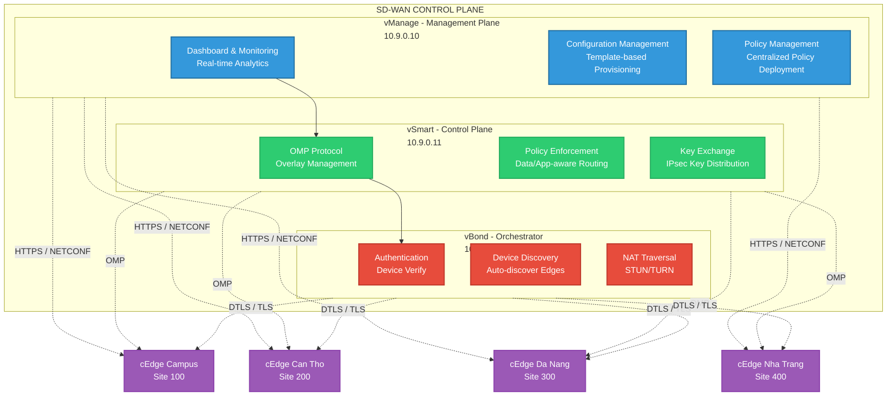
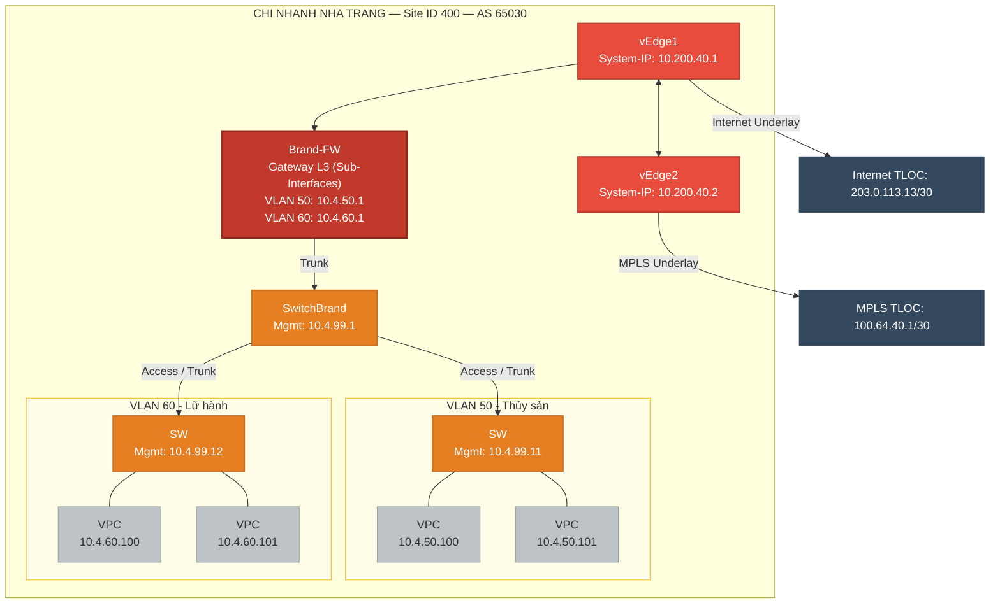

import os

md_content = """# Sơ Đồ Campus Network sử dụng SD-WAN

## Tổng quan kiến trúc

Dự án xây dựng Campus Network kết hợp **SD-WAN (Software-Defined Wide Area Network)** với các thành phần:

- **Campus chính (Site ID 100, AS 65000)**: Mô hình 3 lớp Core–Distribution–Access, với Firewall HA Pair bảo vệ LAN ↔ WAN và Server Farm/DMZ riêng biệt.
- **Chi nhánh Cần Thơ (Site ID 200, AS 65010)**: Có Branch Firewall, chia VLAN theo phòng ban (VLAN 60: Nông nghiệp, VLAN 70: Y Tế).
- **Chi nhánh Đà Nẵng (Site ID 300, AS 65020)**: Có Branch Firewall, chia VLAN theo phòng ban (VLAN 80: Du lịch, VLAN 90: Tài chính).
- **Chi nhánh Nha Trang (Site ID 400, AS 65030)**: Có Branch Firewall, chia VLAN theo phòng ban (VLAN 50: Thủy sản, VLAN 60: Lữ hành).
- **SD-WAN Controller Cluster (Site 900)**: vManage, vSmart, vBond (đặt tại Data Center hoặc Cloud).
- **Hạ tầng WAN**: Internet + MPLS qua Service Provider, IPsec SD-WAN Overlay.
- **SDN (OpenFlow)**: SDN_CONTROLLER (Ryu) quản lý toàn bộ L2 campus qua OpenFlow 1.3: **Dist-SW1/2 + Access-SW1–4** (data plane campus). Control plane chạy **trên VLAN 99 MANAGEMENT** (dải 10.1.99.0/24, controller 10.1.99.10) qua các link uplink sẵn có — không có link riêng. App `campus_switch_13.py`: học MAC theo VLAN + ACL proactive (chặn port qua controller) + REST northbound (`ofctl_rest`, port 8080). *(Node test cũ AccessTest + VPC11/12 đã xóa 04/08/2026.)*

---

## 1. Mermaid Code — Sơ Đồ Campus Network SD-WAN

> **Lưu ý**: Draw.io hỗ trợ import Mermaid. Vào **Extras > Edit Diagram** (hoặc **+ > Advanced > Mermaid**), dán code bên dưới.

### 1.1. Sơ đồ tổng thể (Top-Level Architecture)

```mermaid
flowchart TD

%% ================== SITE 100 - CAMPUS CHINH ==================
subgraph SITE100["CAMPUS CHINH - SITE ID 100 - AS 65000"]
    subgraph DMZ100["DMZ - 10.1.1.0/28"]
        S1_WEB["Web-Server<br/>10.1.1.10"]
        S1_MAIL["Mail-Server<br/>10.1.1.11"]
        S1_SWDMZ["SwitchDMZ<br/>Mgmt 10.1.99.31"]
    end
    subgraph SF100["SERVER FARM - VLAN90 10.1.90.0/24"]
        S1_DHCP["DHCP-Server<br/>10.1.90.10"]
        S1_SYSLOG["Syslog-Server<br/>10.1.90.11"]
        S1_SWSF["SwitchServerFarm<br/>Mgmt 10.1.99.32"]
    end
    S1_VE1["vEdge1<br/>System-IP 10.200.100.1"]
    S1_VE2["vEdge2<br/>System-IP 10.200.100.2"]
    S1_FWA["FW-ASAv-Active<br/>In:10.1.2.1 Out:10.1.3.1<br/>Mgmt:10.1.99.41 FO:Gi0/5"]
    S1_FWS["FW-ASAv-Standby<br/>In:10.1.2.2 Out:10.1.3.2<br/>Mgmt:10.1.99.42 FO:Gi0/5"]
    S1_C1["Core-SW1<br/>Loopback 10.1.0.1<br/>VRRP Active - Mgmt 10.1.99.1"]
    S1_C2["Core-SW2<br/>Loopback 10.1.0.2<br/>VRRP Standby - Mgmt 10.1.99.2"]
    S1_D1["Dist-SW1<br/>Mgmt 10.1.99.11 (thuan L2)"]
    S1_D2["Dist-SW2<br/>Mgmt 10.1.99.12 (thuan L2)"]
    S1_A1["Access-SW1<br/>VLAN10 CNTT 10.1.10.0/24<br/>VRRP GW 10.1.10.1<br/>Mgmt 10.1.99.21"]
    S1_A2["Access-SW2<br/>VLAN20 TTK 10.1.20.0/24<br/>VRRP GW 10.1.20.1<br/>Mgmt 10.1.99.22"]
    S1_A3["Access-SW3<br/>VLAN30 LUAT 10.1.30.0/24<br/>VRRP GW 10.1.30.1<br/>Mgmt 10.1.99.23"]
    S1_A4["Access-SW4<br/>VLAN40 HanhChinh 10.1.40.0/24<br/>VRRP GW 10.1.40.1<br/>Mgmt 10.1.99.24"]
    S1_VPC14["VPC14"]
    S1_VPC19["VPC19"]
    S1_VPC20["VPC20"]
    S1_VPC21["VPC21"]
    S1_VPC15["VPC15"]
    S1_VPC16["VPC16"]
    S1_VPC17["VPC17"]
    S1_VPC18["VPC18"]
end

%% ================== SITE 200 - CAMPUS CAN THO ==================
subgraph SITE200["CAMPUS CAN THO - SITE ID 200 - AS 65010"]
    S2_VE1["vEdge1<br/>System-IP 10.200.200.1"]
    S2_VE2["vEdge2<br/>System-IP 10.200.200.2"]
    S2_FW["Brand-FW<br/>Gateway (VLAN 60, 70) Out:10.2.1.1"]
    S2_SWB["SwitchBrand<br/>Mgmt 10.2.99.1"]
    S2_SWA["SW (VLAN 60 Nongnghi)<br/>Mgmt 10.2.99.11"]
    S2_SWB2["SW (VLAN 70 YTe)<br/>Mgmt 10.2.99.12"]
    S2_VPC1["VPC Nongnghi"]
    S2_VPC2["VPC Nongnghi"]
    S2_VPC3["VPC YTe"]
    S2_VPC4["VPC YTe"]
end

%% ================== SITE 300 - CAMPUS DA NANG ==================
subgraph SITE300["CAMPUS DA NANG - SITE ID 300 - AS 65020"]
    S3_VE1["vEdge1<br/>System-IP 10.200.30.1"]
    S3_VE2["vEdge2<br/>System-IP 10.200.30.2"]
    S3_FW["Brand-FW<br/>Gateway (VLAN 80, 90) Out:10.3.1.1"]
    S3_SWB["SwitchBrand<br/>Mgmt 10.3.99.1"]
    S3_SWA["SW (VLAN 80 Dulich)<br/>Mgmt 10.3.99.11"]
    S3_SWB2["SW (VLAN 90 Taichinh)<br/>Mgmt 10.3.99.12"]
    S3_VPC1["VPC Dulich"]
    S3_VPC2["VPC Dulich"]
    S3_VPC3["VPC Taichinh"]
    S3_VPC4["VPC Taichinh"]
end

%% ================== SITE 400 - CAMPUS NHA TRANG ==================
subgraph SITE400["CAMPUS NHA TRANG - SITE ID 400 - AS 65030"]
    S4_VE1["vEdge1<br/>System-IP 10.200.40.1"]
    S4_VE2["vEdge2<br/>System-IP 10.200.40.2"]
    S4_FW["Brand-FW<br/>Gateway (VLAN 50, 60) Out:10.4.1.1"]
    S4_SWB["SwitchBrand<br/>Mgmt 10.4.99.1"]
    S4_SWA["SW (VLAN 50 Thuysan)<br/>Mgmt 10.4.99.11"]
    S4_SWB2["SW (VLAN 60 Luhanh)<br/>Mgmt 10.4.99.12"]
    S4_VPC1["VPC Thuysan"]
    S4_VPC2["VPC Thuysan"]
    S4_VPC3["VPC Luhanh"]
    S4_VPC4["VPC Luhanh"]
end

%% ================== SD-WAN CONTROLLER ==================
subgraph CTRL["SD-WAN CONTROLLER - Site 900 - 10.9.0.0/16"]
    CTRL_SW1["Switch<br/>10.9.0.1"]
    CTRL_VMANAGE["vManager<br/>10.9.0.10"]
    CTRL_VSMART["vSmart<br/>10.9.0.11"]
    CTRL_VBOND["vBond<br/>10.9.0.12 (+public 203.0.113.100)"]
    CTRL_SW2["Switch<br/>10.9.0.2"]
    CTRL_WIN["Win<br/>10.9.0.20"]
end

%% ================== SERVICE PROVIDER ==================
subgraph SP["SERVICE PROVIDER - Underlay Transport"]
    SP_NET(("Net"))
    SP_INTERNET["Internet Router<br/>203.0.113.254"]
    SP_MPLS["MPLS Router<br/>100.64.255.254"]
end

%% ================== KET NOI SITE 100 ==================
S1_WEB --> S1_SWDMZ
S1_MAIL --> S1_SWDMZ
S1_SWDMZ --> S1_FWA
S1_SWDMZ --> S1_FWS
S1_VE1 --> S1_FWA
S1_VE1 --> S1_FWS
S1_VE2 --> S1_FWA
S1_VE2 --> S1_FWS
S1_FWA --> S1_C1
S1_FWA --> S1_C2
S1_FWS --> S1_C1
S1_FWS --> S1_C2
S1_FWA <-->|"Failover Gi0/5"| S1_FWS
S1_C1 <--> S1_C2
S1_C1 --> S1_SWSF
S1_SWSF --> S1_DHCP
S1_SWSF --> S1_SYSLOG
S1_C1 --> S1_D1
S1_C1 --> S1_D2
S1_C2 --> S1_D1
S1_C2 --> S1_D2
S1_D1 <--> S1_D2
S1_D1 --> S1_A1
S1_D1 --> S1_A2
S1_D1 --> S1_A3
S1_D1 --> S1_A4
S1_D2 --> S1_A1
S1_D2 --> S1_A2
S1_D2 --> S1_A3
S1_D2 --> S1_A4
S1_A1 --> S1_VPC14
S1_A1 --> S1_VPC19
S1_A2 --> S1_VPC20
S1_A2 --> S1_VPC21
S1_A3 --> S1_VPC15
S1_A3 --> S1_VPC16
S1_A4 --> S1_VPC17
S1_A4 --> S1_VPC18

%% ================== KET NOI SITE 200 ==================
S2_VE1 <--> S2_VE2
S2_VE1 --> S2_FW
S2_FW --> S2_SWB
S2_SWB --> S2_SWA
S2_SWB --> S2_SWB2
S2_SWA --- S2_VPC1
S2_SWA --- S2_VPC2
S2_SWB2 --- S2_VPC3
S2_SWB2 --- S2_VPC4

%% ================== KET NOI SITE 300 ==================
S3_VE1 <--> S3_VE2
S3_VE1 --> S3_FW
S3_FW --> S3_SWB
S3_SWB --> S3_SWA
S3_SWB --> S3_SWB2
S3_SWA --- S3_VPC1
S3_SWA --- S3_VPC2
S3_SWB2 --- S3_VPC3
S3_SWB2 --- S3_VPC4

%% ================== KET NOI SITE 400 ==================
S4_VE1 <--> S4_VE2
S4_VE1 --> S4_FW
S4_FW --> S4_SWB
S4_SWB --> S4_SWA
S4_SWB --> S4_SWB2
S4_SWA --- S4_VPC1
S4_SWA --- S4_VPC2
S4_SWB2 --- S4_VPC3
S4_SWB2 --- S4_VPC4

%% ================== KET NOI SD-WAN CONTROLLER ==================
CTRL_SW1 --- CTRL_VMANAGE
CTRL_SW1 --- CTRL_VSMART
CTRL_SW1 --- CTRL_VBOND
CTRL_SW1 --- CTRL_SW2
CTRL_SW2 --- CTRL_WIN

%% ================== KET NOI SERVICE PROVIDER (UNDERLAY) ==================
SP_NET --- SP_INTERNET
SP_NET --- SP_MPLS
CTRL_SW2 --- SP_INTERNET
CTRL_SW2 --- SP_MPLS

S1_VE1 --> SP_INTERNET
S1_VE2 --> SP_MPLS
S2_VE1 --> SP_INTERNET
S2_VE2 --> SP_MPLS
S3_VE1 --> SP_INTERNET
S3_VE2 --> SP_MPLS
S4_VE1 --> SP_INTERNET
S4_VE2 --> SP_MPLS

%% ================== OMP CONTROL PLANE (dai dien) ==================
CTRL_VSMART -.->|"OMP"| S1_VE1
CTRL_VSMART -.->|"OMP"| S2_VE1
CTRL_VSMART -.->|"OMP"| S3_VE1
CTRL_VSMART -.->|"OMP"| S4_VE1

%% ================== MAU SAC ==================
classDef dmz fill:#FFF7C2,stroke:#B7950B,stroke-width:1px,color:#1F2937
classDef serverfarm fill:#D9F2CE,stroke:#4D8B31,stroke-width:1px,color:#1F2937
classDef fw fill:#FFD6D6,stroke:#C0392B,stroke-width:1px,color:#1F2937
classDef core fill:#DCEBFF,stroke:#2563EB,stroke-width:1px,color:#1F2937
classDef dist fill:#E4F3D9,stroke:#4D8B31,stroke-width:1px,color:#1F2937
classDef access fill:#FBE6C7,stroke:#B5762A,stroke-width:1px,color:#1F2937
classDef pcnode fill:#F0F0F0,stroke:#8A8A8A,stroke-width:1px,color:#1F2937
classDef sdwanedge fill:#FCE1EC,stroke:#C2255C,stroke-width:1px,color:#1F2937
classDef sdwanctrl fill:#E9E3FF,stroke:#7C3AED,stroke-width:1px,color:#1F2937
classDef sp fill:#DCEEF7,stroke:#2E86C1,stroke-width:1px,color:#1F2937

class S1_WEB,S1_MAIL,S1_SWDMZ dmz
class S1_DHCP,S1_SYSLOG,S1_SWSF serverfarm
class S1_FWA,S1_FWS,S2_FW,S3_FW,S4_FW fw
class S1_C1,S1_C2 core
class S1_D1,S1_D2 dist
class S1_A1,S1_A2,S1_A3,S1_A4 access
class S1_VPC14,S1_VPC19,S1_VPC20,S1_VPC21,S1_VPC15,S1_VPC16,S1_VPC17,S1_VPC18 pcnode
class S2_VPC1,S2_VPC2,S2_VPC3,S2_VPC4,S3_VPC1,S3_VPC2,S3_VPC3,S3_VPC4,S4_VPC1,S4_VPC2,S4_VPC3,S4_VPC4 pcnode
class S2_SWB,S2_SWA,S2_SWB2,S3_SWB,S3_SWA,S3_SWB2,S4_SWB,S4_SWA,S4_SWB2 dist
class S1_VE1,S1_VE2,S2_VE1,S2_VE2,S3_VE1,S3_VE2,S4_VE1,S4_VE2 sdwanedge
class CTRL_VMANAGE,CTRL_VSMART,CTRL_VBOND,CTRL_SW1,CTRL_SW2,CTRL_WIN sdwanctrl
class SP_INTERNET,SP_MPLS sp
```



---

### 1.2. Sơ đồ chi tiết SD-WAN Controller



---

### 1.3. Sơ đồ chi tiết Campus chính — 3 lớp Core/Distribution/Access + Firewall HA + DMZ

```mermaid
graph TB
    subgraph CAMPUS_SITE["CAMPUS CHINH — Site ID 100 — AS 65000"]

        subgraph SERVERS["SERVER ZONE (VLAN 90 - 10.1.90.0/24)"]
            DHCP["DHCP Server<br/>10.1.90.10"]
            SYSLOG["Syslog Server<br/>10.1.90.11"]
            SWSF["SwitchServerFarm<br/>Mgmt: 10.1.99.32"]
        end

        subgraph CORE["CORE LAYER<br/>OSPF Area 0"]
            CSW1["Core-SW1<br/>L3 Switch<br/>Loopback: 10.1.0.1<br/>Mgmt: 10.1.99.1"]
            CSW2["Core-SW2<br/>L3 Switch<br/>Loopback: 10.1.0.2<br/>Mgmt: 10.1.99.2"]
            CSW1 <-->|"EtherChannel Po10<br/>10.1.0.4/30"| CSW2
        end

        subgraph FWHA["SECURITY ZONE — FIREWALL HA"]
            FW1_D["FW-ASAv-Active<br/>Inside: 10.1.2.1<br/>Outside: 10.1.3.1<br/>Mgmt: 10.1.99.41<br/>Failover: Gi0/5"]
            FW2_D["FW-ASAv-Standby<br/>Inside: 10.1.2.2<br/>Outside: 10.1.3.2<br/>Mgmt: 10.1.99.42<br/>Failover: Gi0/5"]
            FW1_D ---|"Failover (Gi0/5) — HA Sync"| FW2_D
        end

        subgraph DMZ_D["DMZ ZONE — 10.1.1.0/28"]
            WEB_D["WEB Server<br/>10.1.1.10"]
            MAIL_D["Mail Server<br/>10.1.1.11"]
            SWDMZ["SwitchDMZ<br/>Mgmt: 10.1.99.31"]
        end

        subgraph DIST["DISTRIBUTION LAYER<br/>Mgmt VLAN 99"]
            DSW1["Dist-SW1<br/>Mgmt: 10.1.99.11"]
            DSW2["Dist-SW2<br/>Mgmt: 10.1.99.12"]
        end

        subgraph ACCESS["ACCESS LAYER<br/>Mgmt VLAN 99"]
            ASW1["Access-SW1<br/>Mgmt: 10.1.99.21<br/>VLAN10: 10.1.10.0/24<br/>VRRP GW: 10.1.10.1"]
            ASW2["Access-SW2<br/>Mgmt: 10.1.99.22<br/>VLAN20: 10.1.20.0/24<br/>VRRP GW: 10.1.20.1"]
            ASW3["Access-SW3<br/>Mgmt: 10.1.99.23<br/>VLAN30: 10.1.30.0/24<br/>VRRP GW: 10.1.30.1"]
            ASW4["Access-SW4<br/>Mgmt: 10.1.99.24<br/>VLAN40: 10.1.40.0/24<br/>VRRP GW: 10.1.40.1"]
        end

        subgraph PCS["PC / ENDPOINT"]
            PC_V14["VPC14 (VLAN 10)"]
            PC_V19["VPC19 (VLAN 10)"]
            PC_V20["VPC20 (VLAN 20)"]
            PC_V21["VPC21 (VLAN 20)"]
            PC_V15["VPC15 (VLAN 30)"]
            PC_V16["VPC16 (VLAN 30)"]
            PC_V17["VPC17 (VLAN 40)"]
            PC_V18["VPC18 (VLAN 40)"]
        end

        VEDGE1["vEdge1<br/>System-IP: 10.200.100.1"]
        VEDGE2["vEdge2<br/>System-IP: 10.200.100.2"]
    end

    %% Connections
    DHCP --> SWSF
    SYSLOG --> SWSF
    SWSF --> CSW1

    WEB_D --> SWDMZ
    MAIL_D --> SWDMZ
    SWDMZ --> FW1_D
    SWDMZ --> FW2_D

    FW1_D -->|"Inside Zone"| CSW1
    FW2_D -->|"Inside Zone"| CSW2
    VEDGE1 -->|"Outside Zone"| FW1_D
    VEDGE1 -->|"Outside Zone"| FW2_D
    VEDGE2 -->|"Outside Zone"| FW1_D
    VEDGE2 -->|"Outside Zone"| FW2_D

    CSW1 --> DSW1
    CSW1 --> DSW2
    CSW2 --> DSW1
    CSW2 --> DSW2
    DSW1 <--> DSW2

    DSW1 --> ASW1
    DSW1 --> ASW2
    DSW1 --> ASW3
    DSW1 --> ASW4
    DSW2 --> ASW1
    DSW2 --> ASW2
    DSW2 --> ASW3
    DSW2 --> ASW4

    ASW1 --- PC_V14
    ASW1 --- PC_V19
    ASW2 --- PC_V20
    ASW2 --- PC_V21
    ASW3 --- PC_V15
    ASW3 --- PC_V16
    ASW4 --- PC_V17
    ASW4 --- PC_V18

    classDef server fill:#1ABC9C,stroke:#16A085,color:#fff,stroke-width:2px
    classDef core fill:#2980B9,stroke:#1F618D,color:#fff,stroke-width:3px
    classDef fw fill:#C0392B,stroke:#922B21,color:#fff,stroke-width:3px
    classDef dmz fill:#8E44AD,stroke:#6C3483,color:#fff,stroke-width:2px
    classDef dist fill:#27AE60,stroke:#1E8449,color:#fff,stroke-width:2px
    classDef access fill:#E67E22,stroke:#CA6F1E,color:#fff,stroke-width:2px
    classDef pc fill:#BDC3C7,stroke:#95A5A6,color:#333,stroke-width:1px
    classDef edge fill:#E74C3C,stroke:#C0392B,color:#fff,stroke-width:2px

    class DHCP,SYSLOG,SWSF server
    class CSW1,CSW2 core
    class FW1_D,FW2_D fw
    class WEB_D,MAIL_D,SWDMZ dmz
    class DSW1,DSW2 dist
    class ASW1,ASW2,ASW3,ASW4 access
    class PC_V14,PC_V19,PC_V20,PC_V21,PC_V15,PC_V16,PC_V17,PC_V18 pc
    class VEDGE1,VEDGE2 edge
```



---

### 1.4. Sơ đồ chi tiết Chi nhánh Cần Thơ — Site ID 200 (Chia VLAN: Nông nghiệp, Y Tế)


---

### 1.5. Sơ đồ chi tiết Chi nhánh Đà Nẵng — Site ID 300 (Chia VLAN: Du lịch, Tài chính)


---

### 1.6. Sơ đồ chi tiết Chi nhánh Nha Trang — Site ID 400 (Chia VLAN: Thủy sản, Lữ hành)



---

## 2. Bảng Quy Hoạch Địa Chỉ IP (Cập nhật theo Topology .unl)

> **Nguồn tham chiếu**: Bảng này được xây dựng lại dựa trên file topology `Campus Network SDN SD-WAN.unl` (EVE-NG). Mỗi dòng trong bảng 2.2 là **một liên kết vật lý thật** trong topology: thiết bị nào — cổng nào — nối sang thiết bị nào — cổng nào, kèm IP cụ thể. Cột IP ghi **"—"** nghĩa là **cổng đó KHÔNG đặt IP** (chỉ cấu hình L2/VLAN).

### 2.0. Nguyên tắc quy hoạch & quy ước đặt IP

| # | Quy ước | Giải thích |
|---|---|---|
| 1 | Dải tổng thể `10.0.0.0/8` | Octet 2 = số site: **1** = Campus chính, **2** = Cần Thơ, **3** = Đà Nẵng, **4** = Nha Trang, **9** = SD-WAN Controller. Octet 3 = phân khu, octet 4 = host. |
| 2 | Mạng VLAN dùng `/24` | Gateway = `.1` (VRRP VIP trên Core hoặc sub-interface trên Brand-FW). Server đặt `.10`, `.11`. |
| 3 | Liên kết point-to-point dùng `/30` | FW↔Core, FW↔vEdge, vEdge↔vEdge, vEdge↔SP. Quy ước: phía **Firewall** hoặc phía **vEdge** (gần WAN hơn) = `.1`, phía còn lại = `.2`. |
| 4 | Cổng **CÓ IP** | Cổng L3: router, firewall, switch L3 (SVI/Loopback), System-IP vEdge. |
| 5 | Cổng **KHÔNG IP** | Cổng access/trunk của switch L2 (nối PC, server, switch L2 khác) — chỉ cấu hình VLAN. |
| 6 | Loopback OSPF | `10.<site>.0.x/32` (vd: Core-SW1 = 10.1.0.1/32). |
| 7 | System-IP OMP | Địa chỉ /32 duy nhất: Site 100/200 dùng `10.200.100.x`/`10.200.200.x`; Site 300/400/900 rút gọn octet thành `30`/`40`/`90` để hợp lệ IPv4. Chỉ là định danh overlay, **không phải gateway LAN**. |
| 8 | Mặt WAN | Mặt **Internet** dùng dải public `203.0.113.0/24`; mặt **MPLS** dùng `100.64.x.x/30`. |
| 9 | Trunk L2 | Mang các VLAN cần thiết: Campus (10/20/30/40/90/99), chi nhánh (VLAN nghiệp vụ + 99). |
| 10 | VPC (PC ảo) | Mặc định **xin DHCP** (dải `.100 – .199`) bằng lệnh `ip dhcp` trong file `config.txt`; không đặt IP tĩnh. |

### 2.1. Tổng hợp bảng subnet theo từng site

#### 2.1.1. Campus chính — Site 100

| Mạng con | VLAN | Vai trò | Ghi chú |
|---|---|---|---|
| 10.1.10.0/24 | 10 | Khoa CNTT | VPC14, VPC19 |
| 10.1.20.0/24 | 20 | Khoa Toán-TK | VPC20, VPC21 |
| 10.1.30.0/24 | 30 | Khoa Luật | VPC15, VPC16 |
| 10.1.40.0/24 | 40 | Phòng Hành chính | VPC17, VPC18 |
| 10.1.90.0/24 | 90 | Server Farm | DHCP + Syslog Server |
| 10.1.99.0/24 | 99 | Management | IP quản lý switch/FW — switch .1/.2 (Core), .10 (SDN controller), .11/.12 (Dist), .21–.24 (Access), .31 (DMZ), .32 (Farm), **.33/.34 (FW ASDM, failover mgmt)**, **.50 (PC-Management)** |
| 10.1.1.0/28 | — | DMZ | Web, Mail |
| 10.1.2.0/30, .4/30, .8/30, .12/30 | — | FW Inside ↔ Core | 4 link /30 |
| 10.1.3.0/30, .4/30, .8/30, .12/30 | — | FW Outside ↔ vEdge | 4 link /30 |
| 10.1.255.0/29 | — | Failover FW-A ↔ FW-S | Dây Gi0/5 — LAN-FO `failover interface ip failover 10.1.255.1 255.255.255.248 standby 10.1.255.2` khai giống hệt trên CẢ 2 unit (ASA tự gán IP theo vai trò: primary dùng .1, secondary dùng .2) |
| 10.1.0.4/30 | — | Core-SW1 ↔ Core-SW2 (Po10) | 10.1.0.5 / 10.1.0.6 |
| — | 99 (dùng chung) | SDN Control plane / Management — SDN_CONTROLLER 10.1.99.10 ↔ các switch 10.1.99.11/.12/.21–.24 | Chạy trên VLAN 99 MANAGEMENT, dùng link uplink sẵn có (không có link riêng) |

#### 2.1.2. Chi nhánh — Site 200 / 300 / 400

| Site | Mạng con | VLAN | Vai trò |
|---|---|---|---|
| 200 | 10.2.60.0/24 | 60 | Khoa Nông nghiệp |
| 200 | 10.2.70.0/24 | 70 | Khoa Y Tế |
| 200 | 10.2.99.0/24 | 99 | Management |
| 200 | 10.2.1.0/30, 10.2.1.4/30 | — | FW ↔ vEdge |
| 200 | 10.2.2.0/30 | — | vEdge1 ↔ vEdge2 |
| 300 | 10.3.80.0/24 | 80 | Khoa Du lịch |
| 300 | 10.3.90.0/24 | 90 | Khoa Tài chính |
| 300 | 10.3.99.0/24 | 99 | Management |
| 300 | 10.3.1.0/30, 10.3.1.4/30 | — | FW ↔ vEdge |
| 300 | 10.3.2.0/30 | — | vEdge1 ↔ vEdge2 |
| 400 | 10.4.50.0/24 | 50 | Khoa Thủy sản |
| 400 | 10.4.60.0/24 | 60 | Khoa Lữ hành |
| 400 | 10.4.99.0/24 | 99 | Management |
| 400 | 10.4.1.0/30, 10.4.1.4/30 | — | FW ↔ vEdge |
| 400 | 10.4.2.0/30 | — | vEdge1 ↔ vEdge2 |

#### 2.1.3. SD-WAN Controller — Site 900

| Mạng con | Vai trò |
|---|---|
| 10.9.0.0/24 | Controller LAN (Switch32): vManager/vSmart/vBond/Win/vEdge65 |
| 10.9.1.0/24 | Controller uplink Cloud (Switch61) |
| 203.0.113.244/30 | vEdge65 WAN ↔ Switch32 |
| 203.0.113.248/30 | Switch32 ↔ Internet |
| 100.64.255.248/30 | Switch32 ↔ MPLS |

#### 2.1.4. Service Provider (WAN)

| Mạng con | Vai trò |
|---|---|
| 203.0.113.0/24 | Public cloud (Internet Gi0/0 = **DHCP** từ EVE host, cấm IP tĩnh; vBond NAT 1:1 → 203.0.113.100) |
| 203.0.113.0/30, .4/30, .8/30, .12/30, .16/30 | Transit Internet ↔ vEdge (mỗi site 1 link) |
| 100.64.254.0/30 | Internet ↔ MPLS (backbone SP) |
| 100.64.100.0/30, 100.64.100.4/30 | MPLS ↔ vEdge Site 100 |
| 100.64.200.0/30 | MPLS ↔ vEdge Site 200 |
| 100.64.30.0/30 | MPLS ↔ vEdge Site 300 |
| 100.64.40.0/30 | MPLS ↔ vEdge Site 400 |

##### BGP ASN & Peering (Service Provider)

| ASN | Thiết bị | Vai trò |
|---|---|---|
| **64511** | Internet (26) | ISP Internet — eBGP backbone ↔ MPLS, eBGP CE-PE ↔ vEdge Internet TLOC |
| **64512** | MPLS (27) | ISP MPLS — eBGP backbone ↔ Internet, eBGP CE-PE ↔ vEdge MPLS TLOC |
| **65000** | vEdge1/2-S100 | Site 100 (Campus chính) |
| **65010** | vEdge1/2-S200 | Site 200 (Cần Thơ) |
| **65020** | vEdge1/2-S300 | Site 300 (Đà Nẵng) |
| **65030** | vEdge1/2-S400 | Site 400 (Nha Trang) |
| — | Switch32 (site 900) | **Static CE-PE** theo phạm vi thiết kế của vùng controller |

- Backbone SP: eBGP `64511 ↔ 64512` trên 100.64.254.0/30; mỗi ISP quảng bá **transit /30 của mình** cho ISP kia.
- CE-PE: mỗi vEdge eBGP với ISP của transport (Internet TLOC ↔ AS 64511, MPLS TLOC ↔ AS 64512); ISP gửi `default-originate` cho khách hàng.
- Site 900 (Switch32 + vEdge65): giữ static routing theo phạm vi thiết kế; Switch32 hiện dùng IOL High Iron và thực hiện các SVI VLAN 10/250/251/252.

### 2.2. Bảng kết nối cổng chi tiết (thiết bị — cổng — IP)

> Quy ước: cột **Đầu A / Đầu B** ghi `Thiết bị — Cổng = IP`. IP ghi **"—"** = **cổng không đặt IP** (chỉ cấu hình VLAN / L2).

#### 2.2.1. Site 100 — Firewall / Core / Server Farm / DMZ

| # | Đầu A (Thiết bị — Cổng = IP) | Đầu B (Thiết bị — Cổng = IP) | Mạng con | Ghi chú |
|---|---|---|---|---|
| 1 | FW-ASAv-Active — Gi0/0 = 10.1.2.1/30 | Core-SW1 — E1/0 = 10.1.2.2/30 | 10.1.2.0/30 | FW Inside 1 → Core1 (OSPF) |
| 2 | FW-ASAv-Active — Gi0/1 = 10.1.2.5/30 | Core-SW2 — E0/3 = 10.1.2.6/30 | 10.1.2.4/30 | FW Inside 2 → Core2 |
| 3 | FW-ASAv-Standby — Gi0/0 = 10.1.2.9/30 | Core-SW2 — E1/0 = 10.1.2.10/30 | 10.1.2.8/30 | FW Inside 3 → Core2 |
| 4 | FW-ASAv-Standby — Gi0/1 = 10.1.2.13/30 | Core-SW1 — E0/3 = 10.1.2.14/30 | 10.1.2.12/30 | FW Inside 4 → Core1 |
| 5 | FW-ASAv-Active — Gi0/2 = 10.1.3.1/30 | vEdge1-S100 — ge0/0 = 10.1.3.2/30 | 10.1.3.0/30 | FW Outside 1 → vEdge1 (VPN 512) |
| 6 | FW-ASAv-Active — Gi0/3 = 10.1.3.5/30 | vEdge2-S100 — ge0/1 = 10.1.3.6/30 | 10.1.3.4/30 | FW Outside 2 → vEdge2 |
| 7 | FW-ASAv-Standby — Gi0/2 = 10.1.3.9/30 | vEdge2-S100 — ge0/0 = 10.1.3.10/30 | 10.1.3.8/30 | FW Outside 3 → vEdge2 |
| 8 | FW-ASAv-Standby — Gi0/3 = 10.1.3.13/30 | vEdge1-S100 — ge0/1 = 10.1.3.14/30 | 10.1.3.12/30 | FW Outside 4 → vEdge1 |
| 9 | FW-ASAv-Active — Gi0/4 = 10.1.1.1/28 | SwitchDMZ — e0/2 = — | 10.1.1.0/28 | Interface DMZ (gateway DMZ) |
| 10 | FW-ASAv-Standby — Gi0/4 = 10.1.1.2/28 | SwitchDMZ — e0/3 = — | 10.1.1.0/28 | Interface DMZ (dự phòng) |
| 11 | Web-Server — e0 = 10.1.1.10/28 (gw 10.1.1.1) | SwitchDMZ — e0/0 = — | 10.1.1.0/28 | Access DMZ |
| 12 | Mail-Server — e0 = 10.1.1.11/28 (gw 10.1.1.1) | SwitchDMZ — e0/1 = — | 10.1.1.0/28 | Access DMZ |
| 13 | FW-ASAv-Active — Gi0/5 (Failover) | FW-ASAv-Standby — Gi0/5 (Failover) | LAN-FO: `failover interface ip failover 10.1.255.1 255.255.255.248 standby 10.1.255.2` (giống hệt 2 unit) | Dây Failover/HA-Sync — ASA tự gán IP theo vai trò (primary .1 / secondary .2) |
| 14 | Core-SW1 — Po10 (E0/0+E0/1) = 10.1.0.5/30 | Core-SW2 — Po10 (E0/0+E0/1) = 10.1.0.6/30 | 10.1.0.4/30 | EtherChannel giữa 2 Core |
| 15 | Core-SW1 — E1/1 = — | SwitchServerFarm — e0/0 = — | Trunk (90,99) | L2 trunk → Server Farm |
| 16 | Core-SW2 — E1/1 = — | SwitchServerFarm — e0/3 = — | Trunk (90,99) | L2 trunk → Server Farm |
| 17 | DHCP-Server — e0 = 10.1.90.10/24 | SwitchServerFarm — e1/1 = — | 10.1.90.0/24 | Access VLAN 90 (dây EVE cắm tại cổng E1/1 — id 17) |
| 18 | Syslog-Server — e0 = 10.1.90.11/24 | SwitchServerFarm — e0/2 = — | 10.1.90.0/24 | Access VLAN 90 |
| 19 | FW-ASAv-Active — Management0/0 = 10.1.99.33/24 (active) | SwitchServerFarm — e1/2 = — | VLAN 99 | Access VLAN 99 — ASDM/management, `failover management-interface management` (active .33 / standby .34 tự hoán đổi) |
| 20 | FW-ASAv-Standby — Management0/0 = 10.1.99.34/24 (standby) | SwitchServerFarm — e1/3 = — | VLAN 99 | Access VLAN 99 — ASDM/management |
| 21 | PC-Management — e0 = 10.1.99.50/24 (gw 10.1.99.1) | SwitchServerFarm — e2/0 = — | VLAN 99 | Access VLAN 99 — PC quản trị, truy cập ASDM https://10.1.99.33 / .34 |

#### 2.2.2. Site 100 — Distribution / Access / PC

| # | Đầu A (Thiết bị — Cổng = IP) | Đầu B (Thiết bị — Cổng = IP) | Mạng con | Ghi chú |
|---|---|---|---|---|
| 18 | Core-SW1 — E0/2 = — | Dist-SW1 — e6 = — | Trunk | L2 Core → Dist |
| 19 | Core-SW1 — E1/2 = — | Dist-SW2 — e7 = — | Trunk | L2 Core → Dist |
| 20 | Core-SW2 — E0/2 = — | Dist-SW2 — e6 = — | Trunk | L2 Core → Dist |
| 21 | Core-SW2 — E1/2 = — | Dist-SW1 — e7 = — | Trunk | L2 Core → Dist |
| 22 | Dist-SW1 — e5 = — | Dist-SW2 — e5 = — | Trunk | L2 Dist ↔ Dist |
| 23 | Dist-SW1 — e1 = — | Access-SW1 — e1 = — | Trunk | L2 Dist → Access |
| 24 | Dist-SW1 — e2 = — | Access-SW2 — e1 = — | Trunk | L2 Dist → Access |
| 25 | Dist-SW1 — e3 = — | Access-SW3 — e1 = — | Trunk | L2 Dist → Access |
| 26 | Dist-SW1 — e4 = — | Access-SW4 — e1 = — | Trunk | L2 Dist → Access |
| 27 | Dist-SW2 — e1 = — | Access-SW1 — e2 = — | Trunk | L2 Dist → Access |
| 28 | Dist-SW2 — e2 = — | Access-SW2 — e2 = — | Trunk | L2 Dist → Access |
| 29 | Dist-SW2 — e3 = — | Access-SW3 — e2 = — | Trunk | L2 Dist → Access |
| 30 | Dist-SW2 — e4 = — | Access-SW4 — e2 = — | Trunk | L2 Dist → Access |
| 31 | Access-SW1 — e3 = — | VPC14 (PC CNTT-1) — eth0 = DHCP (10.1.10.100–.199) | VLAN 10 | Access VLAN 10, gw 10.1.10.1 |
| 32 | Access-SW1 — e4 = — | VPC19 (PC CNTT-2) — eth0 = DHCP (10.1.10.100–.199) | VLAN 10 | Access VLAN 10 |
| 33 | Access-SW2 — e3 = — | VPC20 (PC TTK-1) — eth0 = DHCP (10.1.20.100–.199) | VLAN 20 | gw 10.1.20.1 |
| 34 | Access-SW2 — e4 = — | VPC21 (PC TTK-2) — eth0 = DHCP (10.1.20.100–.199) | VLAN 20 | Access VLAN 20 |
| 35 | Access-SW3 — e3 = — | VPC15 (PC Luật-1) — eth0 = DHCP (10.1.30.100–.199) | VLAN 30 | gw 10.1.30.1 |
| 36 | Access-SW3 — e4 = — | VPC16 (PC Luật-2) — eth0 = DHCP (10.1.30.100–.199) | VLAN 30 | Access VLAN 30 |
| 37 | Access-SW4 — e3 = — | VPC17 (PC HC-1) — eth0 = DHCP (10.1.40.100–.199) | VLAN 40 | gw 10.1.40.1 |
| 38 | Access-SW4 — e4 = — | VPC18 (PC HC-2) — eth0 = DHCP (10.1.40.100–.199) | VLAN 40 | Access VLAN 40 |

#### 2.2.3. Site 100 — SDN Controller & Test (OpenFlow)

| # | Đầu A (Thiết bị — Cổng = IP) | Đầu B (Thiết bị — Cổng = IP) | Mạng con | Ghi chú |
|---|---|---|---|---|
| 39 | SDN_CONTROLLER — e0 = 10.1.99.10/24 | SwitchServerFarm — e1/0 (access VLAN 99) = — | VLAN 99 | Management plane SDN — cắm vào server farm, đi theo VLAN 99 MANAGEMENT |
| 40 | SDN_CONTROLLER — e3 = DHCP (Cloud) | Cloud-NAT (pnet0) = — | Internet | e3 = Cloud-NAT — Internet từ host EVE cho cài Ryu/pip |

> **Lưu ý**: Control plane SDN **không còn link riêng** (mạng 10.1.100.0/24 đã bỏ, link cũ #40–45 xóa khỏi lab 07/08/2026). SDN_CONTROLLER cắm **e0 → SwitchServerFarm e1/0 (access VLAN 99)** với IP **10.1.99.10/24**; các switch OVS có sẵn cổng mgmt trong VLAN 99 (Dist 10.1.99.11/.12, Access .21–.24) nên kênh điều khiển OpenFlow 1.3 (TCP 6653) đi **trên chính VLAN 99 MANAGEMENT, qua các link uplink sẵn có** — đúng kiến trúc doanh nghiệp: controller dùng chung mạng quản trị, không cần kéo dây riêng tới từng switch. Mỗi switch `set-controller br0 tcp:10.1.99.10:6653`. **SDN_CONTROLLER e3 = `Cloud-NAT` (pnet0)** — kéo Internet từ host EVE phục vụ cài Ryu/pip trong `SDN_CONTROLLER.sh`. *(Node test cũ AccessTest + VPC11/12 cùng mạng 10.1.101.0/24 đã xóa khỏi lab 04/08/2026.)*

#### 2.2.4. Cần Thơ — Site 200

| # | Đầu A (Thiết bị — Cổng = IP) | Đầu B (Thiết bị — Cổng = IP) | Mạng con | Ghi chú |
|---|---|---|---|---|
| 1 | Brand-FW — Gi0/1 = 10.2.1.1/30 | vEdge1-S200 — ge0/0 = 10.2.1.2/30 | 10.2.1.0/30 | Outside → vEdge1 |
| 2 | Brand-FW — Gi0/2 = 10.2.1.5/30 | vEdge2-S200 — ge0/1 = 10.2.1.6/30 | 10.2.1.4/30 | Outside → vEdge2 |
| 3 | Brand-FW — Gi0/0.60 = 10.2.60.1/24, Gi0/0.70 = 10.2.70.1/24, Gi0/0.99 = 10.2.99.1/24 | SwitchBrand — e0/2 = — | Trunk (60,70,99) | Sub-interface (router-on-a-stick) |
| 4 | vEdge1-S200 — ge0/3 = 10.2.2.1/30 | vEdge2-S200 — ge0/2 = 10.2.2.2/30 | 10.2.2.0/30 | Liên kết 2 vEdge (redundancy) |
| 5 | vEdge1-S200 — ge0/2 = 100.64.200.1/30 | MPLS — Gi0/4 = 100.64.200.2/30 | 100.64.200.0/30 | WAN MPLS (TLOC) |
| 6 | vEdge2-S200 — ge0/0 = 203.0.113.9/30 | Internet — Gi0/5 = 203.0.113.10/30 | 203.0.113.8/30 | WAN Internet (TLOC) |
| 7 | SwitchBrand — e0/0 = — | SW55 — e0/0 = — | Trunk (60,99) | L2 |
| 8 | SwitchBrand — e0/1 = — | SW56 — e0/0 = — | Trunk (70,99) | L2 |
| 9 | SW55 — e0/1 = — | VPC43 (PC NN-1) — eth0 = DHCP (10.2.60.100–.199) | VLAN 60 | gw 10.2.60.1 |
| 10 | SW55 — e0/2 = — | VPC44 (PC NN-2) — eth0 = DHCP (10.2.60.100–.199) | VLAN 60 | Access VLAN 60 |
| 11 | SW56 — e0/1 = — | VPC46 (PC YT-1) — eth0 = DHCP (10.2.70.100–.199) | VLAN 70 | gw 10.2.70.1 |
| 12 | SW56 — e0/2 = — | VPC47 (PC YT-2) — eth0 = DHCP (10.2.70.100–.199) | VLAN 70 | Access VLAN 70 |

#### 2.2.5. Đà Nẵng — Site 300

| # | Đầu A (Thiết bị — Cổng = IP) | Đầu B (Thiết bị — Cổng = IP) | Mạng con | Ghi chú |
|---|---|---|---|---|
| 1 | Brand-FW — Gi0/1 = 10.3.1.1/30 | vEdge1-S300 — ge0/2 = 10.3.1.2/30 | 10.3.1.0/30 | Outside → vEdge1 |
| 2 | Brand-FW — Gi0/0 = 10.3.1.5/30 | vEdge2-S300 — ge0/2 = 10.3.1.6/30 | 10.3.1.4/30 | Outside → vEdge2 |
| 3 | Brand-FW — Gi0/2.80 = 10.3.80.1/24, Gi0/2.90 = 10.3.90.1/24, Gi0/2.99 = 10.3.99.1/24 | SwitchBrand — e0/0 = — | Trunk (80,90,99) | Sub-interface |
| 4 | vEdge1-S300 — ge0/1 = 10.3.2.1/30 | vEdge2-S300 — ge0/1 = 10.3.2.2/30 | 10.3.2.0/30 | Liên kết 2 vEdge |
| 5 | vEdge1-S300 — ge0/0 = 100.64.30.1/30 | MPLS — Gi0/5 = 100.64.30.2/30 | 100.64.30.0/30 | WAN MPLS (TLOC) |
| 6 | vEdge2-S300 — ge0/0 = 203.0.113.13/30 | Internet — Gi0/6 = 203.0.113.14/30 | 203.0.113.12/30 | WAN Internet (TLOC) |
| 7 | SwitchBrand — e0/1 = — | SW58 — e0/0 = — | Trunk (80,99) | L2 |
| 8 | SwitchBrand — e0/2 = — | SW59 — e0/0 = — | Trunk (90,99) | L2 |
| 9 | SW58 — e0/1 = — | VPC50 (PC DL-1) — eth0 = DHCP (10.3.80.100–.199) | VLAN 80 | gw 10.3.80.1 |
| 10 | SW58 — e0/2 = — | VPC54 (PC DL-2) — eth0 = DHCP (10.3.80.100–.199) | VLAN 80 | Access VLAN 80 |
| 11 | SW59 — e0/1 = — | VPC53 (PC TC-1) — eth0 = DHCP (10.3.90.100–.199) | VLAN 90 | gw 10.3.90.1 |
| 12 | SW59 — e0/2 = — | VPC48 (PC TC-2) — eth0 = DHCP (10.3.90.100–.199) | VLAN 90 | Access VLAN 90 |

#### 2.2.6. Nha Trang — Site 400

| # | Đầu A (Thiết bị — Cổng = IP) | Đầu B (Thiết bị — Cổng = IP) | Mạng con | Ghi chú |
|---|---|---|---|---|
| 1 | Brand-FW — Gi0/0 = 10.4.1.1/30 | vEdge1-S400 — eth0 = 10.4.1.2/30 | 10.4.1.0/30 | Outside → vEdge1 |
| 2 | Brand-FW — Gi0/1 = 10.4.1.5/30 | vEdge2-S400 — eth0 = 10.4.1.6/30 | 10.4.1.4/30 | Outside → vEdge2 |
| 3 | Brand-FW — Gi0/2.50 = 10.4.50.1/24, Gi0/2.60 = 10.4.60.1/24, Gi0/2.99 = 10.4.99.1/24 | SwitchBrand — e0/0 = — | Trunk (50,60,99) | Sub-interface |
| 4 | vEdge1-S400 — ge0/1 = 10.4.2.1/30 | vEdge2-S400 — ge0/1 = 10.4.2.2/30 | 10.4.2.0/30 | Liên kết 2 vEdge |
| 5 | vEdge1-S400 — ge0/0 = 100.64.40.1/30 | MPLS — Gi0/6 = 100.64.40.2/30 | 100.64.40.0/30 | WAN MPLS (TLOC) |
| 6 | vEdge2-S400 — ge0/0 = 203.0.113.17/30 | Internet — Gi0/7 = 203.0.113.18/30 | 203.0.113.16/30 | WAN Internet (TLOC) |
| 7 | SwitchBrand — e0/1 = — | SW60 — e0/0 = — | Trunk (50,99) | L2 |
| 8 | SwitchBrand — e0/2 = — | SW57 — e0/0 = — | Trunk (60,99) | L2 |
| 9 | SW60 — e0/1 = — | VPC51 (PC TS-1) — eth0 = DHCP (10.4.50.100–.199) | VLAN 50 | gw 10.4.50.1 |
| 10 | SW60 — e0/2 = — | VPC45 (PC TS-2) — eth0 = DHCP (10.4.50.100–.199) | VLAN 50 | Access VLAN 50 |
| 11 | SW57 — e0/1 = — | VPC49 (PC LH-1) — eth0 = DHCP (10.4.60.100–.199) | VLAN 60 | gw 10.4.60.1 |
| 12 | SW57 — e0/2 = — | VPC52 (PC LH-2) — eth0 = DHCP (10.4.60.100–.199) | VLAN 60 | Access VLAN 60 |

#### 2.2.7. SD-WAN Controller — Site 900

| # | Đầu A (Thiết bị — Cổng = IP) | Đầu B (Thiết bị — Cổng = IP) | Mạng con | Ghi chú |
|---|---|---|---|---|
| 1 | vManager — eth0 = 10.9.0.10/24 | Switch32 — Gi0/2 = — | 10.9.0.0/24 | Controller LAN (VLAN 10) |
| 2 | vSmart — eth0 = 10.9.0.11/24 | Switch32 — Gi0/1 = — | 10.9.0.0/24 | Controller LAN |
| 3 | vBond — ge0/0 = 10.9.0.12/24 | Switch32 — Gi0/0 = — | 10.9.0.0/24 | Controller LAN |
| 4 | Win (Quản trị) — e0 = 10.9.0.20/24 (gw 10.9.0.2) | Switch32 — Gi0/3 = — | 10.9.0.0/24 | Máy quản trị truy cập vManager |
| 5 | vEdge65 — ge0/1 = 10.9.0.100/24 | Switch32 — Gi1/3 = — | 10.9.0.0/24 | LAN vEdge65 (VPN 512) |
| 6 | vEdge65 — ge0/0 = 203.0.113.245/30 | Switch32 — Gi1/2 = 203.0.113.246/30 | 203.0.113.244/30 | WAN vEdge65 (TLOC) |
| 7 | Internet — Gi0/2 = 203.0.113.250/30 | Switch32 — Gi1/0 = 203.0.113.249/30 | 203.0.113.248/30 | Uplink Internet của Controller |
| 8 | MPLS — Gi0/1 = 100.64.255.250/30 | Switch32 — Gi1/1 = 100.64.255.249/30 | 100.64.255.248/30 | Uplink MPLS của Controller |
| 9 | Switch32 — SVI VLAN 10 = 10.9.0.2/24 | — | 10.9.0.0/24 | Gateway Controller LAN |
| 10 | Switch61 — e0/0 = — | Cloud "Net" — — | — | Uplink cloud (Internet) |
| 11 | vManager — eth1 = 10.9.1.10/24 | Switch61 — e0/1 = — | 10.9.1.0/24 | Mặt cloud của vManager |
| 12 | vSmart — eth1 = 10.9.1.11/24 | Switch61 — e0/2 = — | 10.9.1.0/24 | Mặt cloud của vSmart |
| 13 | vBond — eth0 = 10.9.1.12/24 | Switch61 — e0/3 = — | 10.9.1.0/24 | Mặt cloud của vBond (NAT 1:1 → 203.0.113.100) |
| 14 | Switch61 — SVI = 10.9.1.1/24 | — | 10.9.1.0/24 | Gateway mạng cloud |

> **Lưu ý**: Cổng WAN của Switch32 (Gi1/0, Gi1/1, Gi1/2) cho vào VLAN riêng (vd 250/251/252) và đặt IP trên SVI tương ứng; các cổng Gi0/0–Gi0/3, Gi1/3 để VLAN 10 (Controller LAN).

#### 2.2.8. Service Provider — Internet / MPLS

| # | Đầu A (Thiết bị — Cổng = IP) | Đầu B (Thiết bị — Cổng = IP) | Mạng con | Ghi chú |
|---|---|---|---|---|
| 1 | Internet — Gi0/1 = 100.64.254.1/30 | MPLS — Gi0/0 = 100.64.254.2/30 | 100.64.254.0/30 | Backbone SP (Internet ↔ MPLS) |
| 2 | Internet — Gi0/0 = DHCP (10.215.28.x) | Cloud "Net" — — | 203.0.113.0/24 | Gateway public ra Internet (DHCP từ EVE host) |
| 3 | Internet — Gi0/4 = 203.0.113.2/30 | vEdge1-S100 — ge0/3 = 203.0.113.1/30 | 203.0.113.0/30 | WAN Internet vEdge1-S100 |
| 4 | Internet — Gi0/3 = 203.0.113.6/30 | vEdge2-S100 — ge0/2 = 203.0.113.5/30 | 203.0.113.4/30 | WAN Internet vEdge2-S100 |
| 5 | Internet — Gi0/5 = 203.0.113.10/30 | vEdge2-S200 — ge0/0 = 203.0.113.9/30 | 203.0.113.8/30 | WAN Internet vEdge2-S200 |
| 6 | Internet — Gi0/6 = 203.0.113.14/30 | vEdge2-S300 — ge0/0 = 203.0.113.13/30 | 203.0.113.12/30 | WAN Internet vEdge2-S300 |
| 7 | Internet — Gi0/7 = 203.0.113.18/30 | vEdge2-S400 — ge0/0 = 203.0.113.17/30 | 203.0.113.16/30 | WAN Internet vEdge2-S400 |
| 8 | MPLS — Gi0/3 = 100.64.100.2/30 | vEdge1-S100 — ge0/2 = 100.64.100.1/30 | 100.64.100.0/30 | WAN MPLS vEdge1-S100 |
| 9 | MPLS — Gi0/2 = 100.64.100.6/30 | vEdge2-S100 — ge0/3 = 100.64.100.5/30 | 100.64.100.4/30 | WAN MPLS vEdge2-S100 |
| 10 | MPLS — Gi0/4 = 100.64.200.2/30 | vEdge1-S200 — ge0/2 = 100.64.200.1/30 | 100.64.200.0/30 | WAN MPLS vEdge1-S200 |
| 11 | MPLS — Gi0/5 = 100.64.30.2/30 | vEdge1-S300 — ge0/0 = 100.64.30.1/30 | 100.64.30.0/30 | WAN MPLS vEdge1-S300 |
| 12 | MPLS — Gi0/6 = 100.64.40.2/30 | vEdge1-S400 — ge0/0 = 100.64.40.1/30 | 100.64.40.0/30 | WAN MPLS vEdge1-S400 |

### 2.3. Bảng IP theo từng thiết bị (tham khảo nhanh khi cấu hình)

#### 2.3.1. SD-WAN Controller — Site 900

| Thiết bị | Interface | IP Address | Subnet | Vai trò |
|---|---|---|---|---|
| **Switch61 (tầng trên)** | SVI | 10.9.1.1 | /24 | Gateway mạng cloud, nối vManager/vSmart/vBond |
| **Switch32 (tầng dưới)** | SVI VLAN 10 | 10.9.0.2 | /24 | Gateway Controller LAN, nối SP + Win + vEdge65 |
| **vManager** | eth0 / eth1 | 10.9.0.10 / 10.9.1.10 | /24 | Quản lý & cấu hình tập trung |
| **vSmart** | eth0 / eth1 | 10.9.0.11 / 10.9.1.11 | /24 | Điều khiển định tuyến overlay (OMP) |
| **vBond** | ge0/0 / eth0 | 10.9.0.12 / 10.9.1.12 | /24 | Xác thực & onboard Edge (NAT 1:1 → 203.0.113.100) |
| **Win (Quản trị)** | e0 | 10.9.0.20 | /24 | Máy quản trị truy cập vManager |
| **vEdge65** | ge0/1 | 10.9.0.100 | /24 | LAN vEdge Site 900 (VPN 512) |
| **vEdge65** | ge0/0 | 203.0.113.245 | /30 | WAN vEdge Site 900 (TLOC) |

#### 2.3.2. Network Services — Campus chính

| Thành phần | Interface | IP Address | Subnet | Vai trò |
|---|---|---|---|---|
| **Web-Server** | e0 | 10.1.1.10 | /28 | Web Server — DMZ (gw 10.1.1.1) |
| **Mail-Server** | e0 | 10.1.1.11 | /28 | Mail Server — DMZ (gw 10.1.1.1) |
| **DHCP-Server** | e0 | 10.1.90.10 | /24 | Cấp IP động (relay từ Core SVIs) |
| **Syslog-Server** | e0 | 10.1.90.11 | /24 | Centralized Logging |
| **SwitchDMZ** | SVI (Mgmt) | 10.1.99.31 | /24 | L2 Switch khu DMZ (uplink kép tới FW) |
| **SwitchServerFarm** | SVI (Mgmt) | 10.1.99.32 | /24 | L2 Switch khu Server Farm (uplink kép tới 2 Core) |
| **SDN_CONTROLLER** | e0 | 10.1.99.10 | /24 | 99 | Management plane SDN (nối SwitchServerFarm e1/0, access VLAN 99) — kênh OpenFlow tới các switch |
| **SDN_CONTROLLER** | e3 | DHCP (cloud) | Internet | — | **Cloud-NAT (pnet0)** — e3/ens6 nhận DHCP từ host EVE, dùng để cài Ryu/pip (không phải control plane) |
| **Dist-SW1 / Dist-SW2** | SVI (Mgmt) | 10.1.99.11 / 10.1.99.12 | /24 | 99 | Control plane: set-controller `tcp:10.1.99.10:6653` |
| **Access-SW1–4** | SVI (Mgmt) | 10.1.99.21 – .24 | /24 | 99 | Control plane: set-controller `tcp:10.1.99.10:6653` |
| **FW-ASAv-Active / Standby** | Management0/0 | 10.1.99.33 / 10.1.99.34 | /24 | 99 | **ASDM management** — `failover management-interface management` (active .33, standby .34 tự hoán đổi), nối SwitchServerFarm e1/2 / e1/3 (access VLAN 99) |
| **PC-Management** | e0 | 10.1.99.50 | /24 | 99 | PC quản trị (win-7) — truy cập ASDM `https://10.1.99.33` (hoặc `.34`), nối SwitchServerFarm e2/0 (access VLAN 99) |

**ASDM (quản lý FW HA bằng giao diện web):**
- PC-Management (node 73, win-7) đặt IP tĩnh **10.1.99.50/24, GW 10.1.99.1** → mở trình duyệt (cần Java 8) tới **`https://10.1.99.33`** (active) hoặc **`https://10.1.99.34`** (standby) → tải ASDM Launcher → đăng nhập `admin` / `vnpro@2026`.
- Cấu hình FW đã khai: `interface Management0/0` (nameif management, security 100), `failover management-interface management Management0/0`, `failover interface ip management 10.1.99.33 … standby 10.1.99.34`, `http server enable` + `http 10.1.99.0 255.255.255.0 management`.
- **Bắt buộc 1 lần trên console cả 2 unit**: `crypto key generate rsa modulus 2048` (RSA key không replicate qua HA). ASDM 7.20(2) nhúng sẵn trong image ASAv (`show version` → Device Manager Version) nên không cần file asdm riêng.

#### 2.3.3. Campus Chính — Site ID 100 (AS 65000)

| Thành phần | Interface | IP Address | Subnet | VLAN | Vai trò |
|---|---|---|---|---|---|
| **FW-ASAv-Active** | Gi0/0 | 10.1.2.1 | /30 | — | Inside 1 → Core-SW1 |
| **FW-ASAv-Active** | Gi0/1 | 10.1.2.5 | /30 | — | Inside 2 → Core-SW2 |
| **FW-ASAv-Active** | Gi0/2 | 10.1.3.1 | /30 | — | Outside 1 → vEdge1 |
| **FW-ASAv-Active** | Gi0/3 | 10.1.3.5 | /30 | — | Outside 2 → vEdge2 |
| **FW-ASAv-Active** | Gi0/4 | 10.1.1.1 | /28 | — | DMZ (gateway DMZ) |
| **FW-ASAv-Active** | Mgmt | 10.1.99.41 | /24 | 99 | Quản lý riêng |
| **FW-ASAv-Active** | Gi0/5 | — (Failover) | — | — | Dây Failover ↔ FW-Standby (HA Sync) |
| **FW-ASAv-Standby** | Gi0/0 | 10.1.2.9 | /30 | — | Inside 1 → Core-SW2 |
| **FW-ASAv-Standby** | Gi0/1 | 10.1.2.13 | /30 | — | Inside 2 → Core-SW1 |
| **FW-ASAv-Standby** | Gi0/2 | 10.1.3.9 | /30 | — | Outside 1 → vEdge2 |
| **FW-ASAv-Standby** | Gi0/3 | 10.1.3.13 | /30 | — | Outside 2 → vEdge1 |
| **FW-ASAv-Standby** | Gi0/4 | 10.1.1.2 | /28 | — | DMZ (dự phòng) |
| **FW-ASAv-Standby** | Mgmt | 10.1.99.42 | /24 | 99 | Quản lý riêng |
| **FW-ASAv-Standby** | Gi0/5 | — (Failover) | — | — | Dây Failover ↔ FW-Active (HA Sync) |
| **Core-SW1** | Loopback0 | 10.1.0.1 | /32 | — | OSPF Router-ID |
| **Core-SW1** | Po10 | 10.1.0.5 | /30 | — | EtherChannel ↔ Core-SW2 |
| **Core-SW1** | VLAN10 SVI | 10.1.10.2 | /24 | 10 | VRRP Active (VIP 10.1.10.1) |
| **Core-SW1** | VLAN20 SVI | 10.1.20.2 | /24 | 20 | VRRP Active (VIP 10.1.20.1) |
| **Core-SW1** | VLAN30 SVI | 10.1.30.2 | /24 | 30 | VRRP Active (VIP 10.1.30.1) |
| **Core-SW1** | VLAN40 SVI | 10.1.40.2 | /24 | 40 | VRRP Active (VIP 10.1.40.1) |
| **Core-SW1** | VLAN90 SVI | 10.1.90.2 | /24 | 90 | VRRP Active (VIP 10.1.90.1) |
| **Core-SW1** | VLAN99 SVI | 10.1.99.1 | /24 | 99 | Quản lý Core1 |
| **Core-SW2** | Loopback0 | 10.1.0.2 | /32 | — | OSPF Router-ID |
| **Core-SW2** | Po10 | 10.1.0.6 | /30 | — | EtherChannel ↔ Core-SW1 |
| **Core-SW2** | VLAN10 SVI | 10.1.10.3 | /24 | 10 | VRRP Standby (VIP 10.1.10.1) |
| **Core-SW2** | VLAN20 SVI | 10.1.20.3 | /24 | 20 | VRRP Standby (VIP 10.1.20.1) |
| **Core-SW2** | VLAN30 SVI | 10.1.30.3 | /24 | 30 | VRRP Standby (VIP 10.1.30.1) |
| **Core-SW2** | VLAN40 SVI | 10.1.40.3 | /24 | 40 | VRRP Standby (VIP 10.1.40.1) |
| **Core-SW2** | VLAN90 SVI | 10.1.90.3 | /24 | 90 | VRRP Standby (VIP 10.1.90.1) |
| **Core-SW2** | VLAN99 SVI | 10.1.99.2 | /24 | 99 | Quản lý Core2 |
| **Dist-SW1** | SVI (Mgmt) | 10.1.99.11 | /24 | 99 | Distribution 1 (thuần L2) — do Ryu quản lý (dpid 5) |
| **Dist-SW2** | SVI (Mgmt) | 10.1.99.12 | /24 | 99 | Distribution 2 (thuần L2) — do Ryu quản lý (dpid 8) |
| **Access-SW1** | SVI (Mgmt) | 10.1.99.21 | /24 | 99 | Access VLAN 10 — CNTT (dpid 68, controller 10.1.99.10) |
| **Access-SW2** | SVI (Mgmt) | 10.1.99.22 | /24 | 99 | Access VLAN 20 — TTK (dpid 66, controller 10.1.99.10) |
| **Access-SW3** | SVI (Mgmt) | 10.1.99.23 | /24 | 99 | Access VLAN 30 — Luật (dpid 70, controller 10.1.99.10) |
| **Access-SW4** | SVI (Mgmt) | 10.1.99.24 | /24 | 99 | Access VLAN 40 — Hành chính (dpid 69, controller 10.1.99.10) |
| **vEdge1-S100** | ge0/0 | 10.1.3.2 | /30 | — | VPN 512 → FW-Active Outside |
| **vEdge1-S100** | ge0/1 | 10.1.3.14 | /30 | — | VPN 512 → FW-Standby Outside |
| **vEdge1-S100** | ge0/2 | 100.64.100.1 | /30 | — | VPN 0 → MPLS (TLOC) |
| **vEdge1-S100** | ge0/3 | 203.0.113.1 | /30 | — | VPN 0 → Internet (TLOC) |
| **vEdge1-S100** | System-IP | 10.200.100.1 | /32 | — | OMP |
| **vEdge2-S100** | ge0/0 | 10.1.3.10 | /30 | — | VPN 512 → FW-Standby Outside |
| **vEdge2-S100** | ge0/1 | 10.1.3.6 | /30 | — | VPN 512 → FW-Active Outside |
| **vEdge2-S100** | ge0/2 | 203.0.113.5 | /30 | — | VPN 0 → Internet (TLOC) |
| **vEdge2-S100** | ge0/3 | 100.64.100.5 | /30 | — | VPN 0 → MPLS (TLOC) |
| **vEdge2-S100** | System-IP | 10.200.100.2 | /32 | — | OMP |

#### 2.3.4. Chi nhánh Cần Thơ — Site ID 200 (AS 65010)

| Thành phần | Interface | IP Address | Subnet | Vai trò |
|---|---|---|---|---|
| **Brand-FW** | Gi0/0.60 | 10.2.60.1 | /24 | Gateway L3 Khoa Nông nghiệp |
| **Brand-FW** | Gi0/0.70 | 10.2.70.1 | /24 | Gateway L3 Khoa Y Tế |
| **Brand-FW** | Gi0/0.99 | 10.2.99.1 | /24 | Gateway Management |
| **Brand-FW** | Gi0/1 | 10.2.1.1 | /30 | Outside → vEdge1 |
| **Brand-FW** | Gi0/2 | 10.2.1.5 | /30 | Outside → vEdge2 |
| **vEdge1-S200** | ge0/0 | 10.2.1.2 | /30 | VPN 512 → Brand-FW |
| **vEdge1-S200** | ge0/2 | 100.64.200.1 | /30 | VPN 0 → MPLS (TLOC) |
| **vEdge1-S200** | ge0/3 | 10.2.2.1 | /30 | VPN 512 ↔ vEdge2 |
| **vEdge1-S200** | System-IP | 10.200.200.1 | /32 | OMP |
| **vEdge2-S200** | ge0/1 | 10.2.1.6 | /30 | VPN 512 → Brand-FW |
| **vEdge2-S200** | ge0/0 | 203.0.113.9 | /30 | VPN 0 → Internet (TLOC) |
| **vEdge2-S200** | ge0/2 | 10.2.2.2 | /30 | VPN 512 ↔ vEdge1 |
| **vEdge2-S200** | System-IP | 10.200.200.2 | /32 | OMP |
| **SwitchBrand** | SVI (Mgmt) | 10.2.99.2 | /24 | Trunking (thuần L2) |
| **SW55 (VLAN 60)** | SVI (Mgmt) | 10.2.99.11 | /24 | Access Switch (Nông nghiệp) |
| **SW56 (VLAN 70)** | SVI (Mgmt) | 10.2.99.12 | /24 | Access Switch (Y Tế) |

#### 2.3.5. Chi nhánh Đà Nẵng — Site ID 300 (AS 65020)

| Thành phần | Interface | IP Address | Subnet | Vai trò |
|---|---|---|---|---|
| **Brand-FW** | Gi0/2.80 | 10.3.80.1 | /24 | Gateway L3 Khoa Du lịch |
| **Brand-FW** | Gi0/2.90 | 10.3.90.1 | /24 | Gateway L3 Khoa Tài chính |
| **Brand-FW** | Gi0/2.99 | 10.3.99.1 | /24 | Gateway Management |
| **Brand-FW** | Gi0/1 | 10.3.1.1 | /30 | Outside → vEdge1 |
| **Brand-FW** | Gi0/0 | 10.3.1.5 | /30 | Outside → vEdge2 |
| **vEdge1-S300** | ge0/2 | 10.3.1.2 | /30 | VPN 512 → Brand-FW |
| **vEdge1-S300** | ge0/0 | 100.64.30.1 | /30 | VPN 0 → MPLS (TLOC) |
| **vEdge1-S300** | ge0/1 | 10.3.2.1 | /30 | VPN 512 ↔ vEdge2 |
| **vEdge1-S300** | System-IP | 10.200.30.1 | /32 | OMP |
| **vEdge2-S300** | ge0/2 | 10.3.1.6 | /30 | VPN 512 → Brand-FW |
| **vEdge2-S300** | ge0/0 | 203.0.113.13 | /30 | VPN 0 → Internet (TLOC) |
| **vEdge2-S300** | ge0/1 | 10.3.2.2 | /30 | VPN 512 ↔ vEdge1 |
| **vEdge2-S300** | System-IP | 10.200.30.2 | /32 | OMP |
| **SwitchBrand** | SVI (Mgmt) | 10.3.99.2 | /24 | Trunking (thuần L2) |
| **SW58 (VLAN 80)** | SVI (Mgmt) | 10.3.99.11 | /24 | Access Switch (Du lịch) |
| **SW59 (VLAN 90)** | SVI (Mgmt) | 10.3.99.12 | /24 | Access Switch (Tài chính) |

#### 2.3.6. Chi nhánh Nha Trang — Site ID 400 (AS 65030)

| Thành phần | Interface | IP Address | Subnet | Vai trò |
|---|---|---|---|---|
| **Brand-FW** | Gi0/2.50 | 10.4.50.1 | /24 | Gateway L3 Khoa Thủy sản |
| **Brand-FW** | Gi0/2.60 | 10.4.60.1 | /24 | Gateway L3 Khoa Lữ hành |
| **Brand-FW** | Gi0/2.99 | 10.4.99.1 | /24 | Gateway Management |
| **Brand-FW** | Gi0/0 | 10.4.1.1 | /30 | Outside → vEdge1 |
| **Brand-FW** | Gi0/1 | 10.4.1.5 | /30 | Outside → vEdge2 |
| **vEdge1-S400** | eth0 | 10.4.1.2 | /30 | VPN 512 → Brand-FW |
| **vEdge1-S400** | ge0/0 | 100.64.40.1 | /30 | VPN 0 → MPLS (TLOC) |
| **vEdge1-S400** | ge0/1 | 10.4.2.1 | /30 | VPN 512 ↔ vEdge2 |
| **vEdge1-S400** | System-IP | 10.200.40.1 | /32 | OMP |
| **vEdge2-S400** | eth0 | 10.4.1.6 | /30 | VPN 512 → Brand-FW |
| **vEdge2-S400** | ge0/0 | 203.0.113.17 | /30 | VPN 0 → Internet (TLOC) |
| **vEdge2-S400** | ge0/1 | 10.4.2.2 | /30 | VPN 512 ↔ vEdge1 |
| **vEdge2-S400** | System-IP | 10.200.40.2 | /32 | OMP |
| **SwitchBrand** | SVI (Mgmt) | 10.4.99.2 | /24 | Trunking (thuần L2) |
| **SW60 (VLAN 50)** | SVI (Mgmt) | 10.4.99.11 | /24 | Access Switch (Thủy sản) |
| **SW57 (VLAN 60)** | SVI (Mgmt) | 10.4.99.12 | /24 | Access Switch (Lữ hành) |

#### 2.3.7. Service Provider — Internet / MPLS

| Thành phần | Interface | IP Address | Subnet | Vai trò |
|---|---|---|---|---|
| **Internet** | Gi0/0 | DHCP (vd 10.215.28.23) | /24 | Gateway public ra Cloud "Net" (DHCP từ EVE host) |
| **Internet** | Gi0/1 | 100.64.254.1 | /30 | ↔ MPLS Gi0/0 |
| **Internet** | Gi0/2 | 203.0.113.250 | /30 | ↔ Switch32 Gi1/0 (Controller) |
| **Internet** | Gi0/3 | 203.0.113.6 | /30 | ↔ vEdge2-S100 |
| **Internet** | Gi0/4 | 203.0.113.2 | /30 | ↔ vEdge1-S100 |
| **Internet** | Gi0/5 | 203.0.113.10 | /30 | ↔ vEdge2-S200 |
| **Internet** | Gi0/6 | 203.0.113.14 | /30 | ↔ vEdge2-S300 |
| **Internet** | Gi0/7 | 203.0.113.18 | /30 | ↔ vEdge2-S400 |
| **MPLS** | Gi0/0 | 100.64.254.2 | /30 | ↔ Internet Gi0/1 |
| **MPLS** | Gi0/1 | 100.64.255.250 | /30 | ↔ Switch32 Gi1/1 (Controller) |
| **MPLS** | Gi0/2 | 100.64.100.6 | /30 | ↔ vEdge2-S100 |
| **MPLS** | Gi0/3 | 100.64.100.2 | /30 | ↔ vEdge1-S100 |
| **MPLS** | Gi0/4 | 100.64.200.2 | /30 | ↔ vEdge1-S200 |
| **MPLS** | Gi0/5 | 100.64.30.2 | /30 | ↔ vEdge1-S300 |
| **MPLS** | Gi0/6 | 100.64.40.2 | /30 | ↔ vEdge1-S400 |

### 2.4. VLAN & DHCP Pool

#### 2.4.1. Campus Chính — Site 100

| VLAN ID | Tên VLAN | Mạng con | Gateway (VRRP VIP) | DHCP Range | Phân khu |
|---|---|---|---|---|---|
| **10** | Khoa CNTT | 10.1.10.0/24 | 10.1.10.1 | 10.1.10.100 – 10.1.10.199 | VPC14, VPC19 |
| **20** | Khoa Toán TK | 10.1.20.0/24 | 10.1.20.1 | 10.1.20.100 – 10.1.20.199 | VPC20, VPC21 |
| **30** | Khoa Luật | 10.1.30.0/24 | 10.1.30.1 | 10.1.30.100 – 10.1.30.199 | VPC15, VPC16 |
| **40** | Phòng HC | 10.1.40.0/24 | 10.1.40.1 | 10.1.40.100 – 10.1.40.199 | VPC17, VPC18 |
| **90** | Server Farm | 10.1.90.0/24 | 10.1.90.1 | Static IP | DHCP/Syslog Server |
| **99** | Management | 10.1.99.0/24 | 10.1.99.1 | Static IP | Quản lý IP các Switch/FW |

> DHCP Server = DHCP-Server (10.1.90.10). Trên SVI của Core-SW1/Core-SW2 (VLAN 10/20/30/40) khai báo `ip helper-address 10.1.90.10` để relay DHCP. **Trạng thái (08/2026): DHCP-Server node 72 chưa cài role DHCP — cấp DHCP campus sẽ triển khai sau** (các VPC mặc định `ip dhcp` nên chưa nhận IP cho tới khi role DHCP hoàn tất).

#### 2.4.2. Chi nhánh — Site 200 / 300 / 400

| Site | VLAN ID | Tên VLAN | Mạng con | Gateway (Brand-FW) | DHCP Range | Phân khu |
|---|---|---|---|---|---|---|
| 200 | **60** | Khoa Nông nghiệp | 10.2.60.0/24 | 10.2.60.1 | 10.2.60.100 – 10.2.60.199 | VPC43, VPC44 |
| 200 | **70** | Khoa Y Tế | 10.2.70.0/24 | 10.2.70.1 | 10.2.70.100 – 10.2.70.199 | VPC46, VPC47 |
| 200 | **99** | Management | 10.2.99.0/24 | 10.2.99.1 | Static IP | SwitchBrand/SW55/SW56 |
| 300 | **80** | Khoa Du lịch | 10.3.80.0/24 | 10.3.80.1 | 10.3.80.100 – 10.3.80.199 | VPC50, VPC54 |
| 300 | **90** | Khoa Tài chính | 10.3.90.0/24 | 10.3.90.1 | 10.3.90.100 – 10.3.90.199 | VPC53, VPC48 |
| 300 | **99** | Management | 10.3.99.0/24 | 10.3.99.1 | Static IP | SwitchBrand/SW58/SW59 |
| 400 | **50** | Khoa Thủy sản | 10.4.50.0/24 | 10.4.50.1 | 10.4.50.100 – 10.4.50.199 | VPC51, VPC45 |
| 400 | **60** | Khoa Lữ hành | 10.4.60.0/24 | 10.4.60.1 | 10.4.60.100 – 10.4.60.199 | VPC49, VPC52 |
| 400 | **99** | Management | 10.4.99.0/24 | 10.4.99.1 | Static IP | SwitchBrand/SW60/SW57 |

> DHCP cho chi nhánh: cấu hình **DHCP server trên Brand-FW** (scope theo từng VLAN), hoặc relay về DHCP-Server campus (10.1.90.10) qua SD-WAN.

> **Nguyên tắc**: Brand-FW dùng sub-interface làm gateway từng VLAN (`.1`), vừa là **default gateway** vừa là **DHCP server** của VLAN nghiệp vụ. Switch phòng ban (IOL) chỉ là **L2 thuần** (trunk/access, SVI Vlan99 quản trị) — không tham gia định tuyến.

#### 2.4.3. Lý do chọn "Firewall-as-Core" cho tầng 3 chi nhánh (quyết định thiết kế)

Có 2 phương án định tuyến tại chi nhánh: **(A) Brand-FW (ASAv) làm điểm L3 duy nhất** — phương án đang triển khai; **(B) thay SwitchBrand bằng router IOS (vios, image `i86bi_LinuxL3-AdvEnterpriseK9-M2_157_3_May_2018.bin`)** làm gateway/router-on-a-stick + DHCP.

| Tiêu chí | (A) Firewall-as-Core — ĐANG DÙNG | (B) Branch Router (vios) |
|---|---|---|
| Mô hình tương ứng thực tế | **SMB/chi nhánh hiện đại** — UTM firewall (FortiGate, Palo Alto...) làm gateway+DHCP | Chi nhánh Cisco cổ điển — ISR router làm WAN+gateway |
| Bảo mật | Security ngay tại điểm định tuyến, mọi traffic qua inspection | Tách rời: router chỉ route, FW đứng sau → **thêm 1 hop** |
| DHCP | `dhcpd` scope theo VLAN, option 3 = gateway FW (khớp vì FW là gw) | `ip dhcp pool` chuẩn IOS (IOL L2/L3 KHÔNG có lệnh này — chỉ router IOS mới có) |
| Định tuyến | Phần mềm ASA, đủ tải chi nhánh nhỏ | Nhanh hơn, nhưng ROAS chỉ 1 trunk, không mở rộng hơn |
| Phù hợp kiến trúc SD-WAN | ✅ vEdge đã đóng vai trò router WAN edge — FW chỉ cần làm security+gateway LAN | Thừa router: vEdge (WAN) + Router (LAN) + FW (security) = 3 thiết bị cho mạng nhỏ |
| Quản trị | 1 thiết bị gộp gateway+DHCP+security | Thêm 1 thiết bị, 1 điểm lỗi, đồng bộ tài liệu/config lại từ đầu |

**Kết luận: giữ phương án (A) Firewall-as-Core.** Phù hợp xu hướng doanh nghiệp hiện đại (firewall làm gateway chi nhánh), giảm số hop và số thiết bị, tận dụng vEdge đã là router WAN. Phương án (B) chỉ mang giá trị tham khảo (đã cân nhắc, không triển khai). Với campus lớn (Site 100) vẫn dùng mô hình 3 lớp truyền thống với L3 switch core — 2 kiến trúc cùng tồn tại có chủ đích.

### 2.5. SD-WAN: System-IP (OMP) & TLOC (Underlay)

| Site | Thiết bị | System-IP (OMP) | TLOC Internet | TLOC MPLS | Số đường WAN |
|---|---|---|---|---|---|
| Campus (100) | vEdge1 | 10.200.100.1 | 203.0.113.1/30 (ge0/3) | 100.64.100.1/30 (ge0/2) | 2 |
| Campus (100) | vEdge2 | 10.200.100.2 | 203.0.113.5/30 (ge0/2) | 100.64.100.5/30 (ge0/3) | 2 |
| Cần Thơ (200) | vEdge1 | 10.200.200.1 | — | 100.64.200.1/30 (ge0/2) | 1 |
| Cần Thơ (200) | vEdge2 | 10.200.200.2 | 203.0.113.9/30 (ge0/0) | — | 1 |
| Đà Nẵng (300) | vEdge1 | 10.200.30.1 | — | 100.64.30.1/30 (ge0/0) | 1 |
| Đà Nẵng (300) | vEdge2 | 10.200.30.2 | 203.0.113.13/30 (ge0/0) | — | 1 |
| Nha Trang (400) | vEdge1 | 10.200.40.1 | — | 100.64.40.1/30 (ge0/0) | 1 |
| Nha Trang (400) | vEdge2 | 10.200.40.2 | 203.0.113.17/30 (ge0/0) | — | 1 |
| Controller (900) | vEdge65 | 10.200.90.1 | 203.0.113.245/30 (ge0/0) | — | 1 |

> **Lưu ý màu TLOC (`tunnel-interface color`) — bài học 30/08/2026:** `color` phải khớp transport thực tế: WAN **Internet** (203.0.113.x) → **`biz-internet`**; WAN **MPLS** (100.64.x) → **`mpls`**. Trước đây vEdge2-S200/S300/S400 khai nhầm `color mpls` trên WAN Internet → fabric không có TLOC `biz-internet` cho chi nhánh → mọi tunnel **biz-internet ↔ MPLS** Down, GUI Health đỏ/QoE thấp. Đã sửa live (30/08/2026) + đồng bộ payload nhúng `.unl` (id 40/41/42). Kiểm tra: `show omp tlocs` thấy TLOC đúng màu, `show bfd sessions` cross-color lên.

### 2.6. Cấu hình mẫu (tham khảo cho người mới)

**1) Core-SW1 — SVI + VRRP + DHCP relay (VLAN 10) — Core dùng **IOL** (image `i86bi_linux_l2-adventerprisek9-ms.SSA.high_iron_20190423.bin`), khai `vtp mode off` + `switchport trunk encapsulation dot1q` trước `switchport mode trunk`:**

```
vtp mode off
!
vlan 10
 name CNTT
!
interface Vlan10
 ip address 10.1.10.2 255.255.255.0
 vrrp 10 ip 10.1.10.1
 vrrp 10 priority 150
 ip helper-address 10.1.90.10
!
interface Ethernet0/2
 switchport trunk encapsulation dot1q
 switchport mode trunk
 switchport trunk allowed vlan 10,20,30,40,90,99
```

**2) FW-ASAv-Active — Inside / Outside (Site 100):**

```
interface GigabitEthernet0/0
 nameif inside
 security-level 100
 ip address 10.1.2.1 255.255.255.252
!
interface GigabitEthernet0/2
 nameif outside
 security-level 0
 ip address 10.1.3.1 255.255.255.252
!
route outside 0.0.0.0 0.0.0.0 10.1.3.2
```

**3) vEdge1-S100 — System-IP, WAN (VPN 0) và LAN (VPN 512):**

```
system
 system-ip 10.200.100.1
 site-id 100
!
vpn 0
 interface ge0/3
  ip address 203.0.113.1/30
!
vpn 512
 interface ge0/0
  ip address 10.1.3.2/30
```

**4) Internet router — Cổng nối vEdge1-S100:**

```
interface GigabitEthernet0/4
 ip address 203.0.113.2 255.255.255.252
 no shutdown
```

> **Lưu ý chung**: (1) Cặp FW-ASAv Active/Standby được nối dây **Failover** tại cổng **Gi0/5** (HA Sync). Dùng LAN-FO subnet 10.1.255.0/29 — lệnh `failover interface ip failover 10.1.255.1 255.255.255.248 standby 10.1.255.2` phải **khai giống hệt trên cả 2 unit** (nếu khai khác nhau — vd standby khai .2/standby .1 — cả 2 unit tự gán trùng IP .1 → failover không lên); ASA trả lời đúng IP theo vai trò (primary=.1, secondary=.2) sau khi negotiation. Sau khi negotiation thành công, config của active sẽ **replication tự động** sang standby (hostname/running-config đồng bộ). (2) Các cổng còn trống (FW Gi0/6–Gi0/7, vEdge ge0/4, ...) không sử dụng. (3) System IP chỉ định danh trên OMP (dạng Loopback), **không dùng làm LAN Gateway**. (4) Core-SW1/2 dùng **IOL** (thay viosl2 từ 11/08/2026) — cú pháp cổng `Ethernet0/x`/`Ethernet1/x`, bắt buộc `vtp mode off` (IOL ở chế độ VTP server rev 0 bị switch khác rev cao quét sạch VLAN DB) và `switchport trunk encapsulation dot1q` trước `switchport mode trunk`.

---

### 2.7. SDN Campus (OpenFlow) — chi tiết triển khai

#### 2.7.1. Kiến trúc

- **Controller**: SDN_CONTROLLER (node 9, Ryu) — app **`campus_switch_13.py`** (trong `configs/01-Site100-Campus/`) + **`ryu.app.ofctl_rest`** (REST northbound, port **8080**).
- **Data plane**: Dist-SW1/2 (dpid **5, 8**) + Access-SW1–4 (dpid **68, 66, 70, 69**) — toàn bộ L2 campus.
- **Control plane**: SDN_CONTROLLER IP **10.1.99.10/24** (e0 → SwitchServerFarm e1/0, access **VLAN 99**); OpenFlow 1.3 qua TCP **6653**. Không có link riêng — kênh điều khiển chạy **trên VLAN 99 MANAGEMENT (mạng quản trị tách riêng) qua các link uplink sẵn có** của campus: mỗi switch OVS có IP mgmt trong VLAN 99 (Dist 10.1.99.11/.12, Access .21–.24) và `set-controller br0 tcp:10.1.99.10:6653`.
- **Về triển khai vật lý thực tế**: trong lab, SDN_CONTROLLER chỉ cắm **đúng 1 cổng** (e0) vào SwitchServerFarm (access VLAN 99) — controller nối vào **một mạng quản trị chung (management fabric / VLAN management)**, không đòi hỏi kéo dây riêng từ controller tới từng switch (điều không thực tế khi các phòng ban ở các tòa nhà/tầng khác nhau). Mỗi switch chỉ cần cổng management (SVI/mgmt trong VLAN 99) đấu vào mạng quản trị đó — mạng quản trị này **đi cùng hạ tầng cáp/fiber uplink sẵn có của campus** (tách khỏi data plane bằng VLAN management riêng). Điều kiện duy nhất cần đảm bảo là **IP reachability L2/L3** giữa controller (10.1.99.10) và switch (10.1.99.x) trong VLAN 99 — đúng với thực tế khi controller đặt tại phòng server nối vào khu Server Farm. SDN_CONTROLLER chỉ quản lý **L2 fabric của Site 100**; các campus xa (200/300/400) không thuộc fabric này mà liên kết bằng SD-WAN overlay — mỗi campus một fabric riêng, kết nối liên campus qua WAN.
- **Chế độ điều khiển**: mỗi bridge OVS đặt `fail_mode=secure` để chỉ chuyển tiếp theo flow do Ryu cài; app phải cài **table-miss priority 0** ngay khi switch kết nối để ARP/broadcast chưa khớp flow được gửi lên controller. Đặt `stp_enable=false` vì OVS STP từng chặn frame trước OpenFlow pipeline, làm controller không nhận `packet-in`. Khi controller mất kết nối, flow đang có vẫn tồn tại đến khi hết timeout nhưng lưu lượng mới không được tự động chuyển bằng `NORMAL`.

#### 2.7.2. Chức năng của app `campus_switch_13.py`

1. **L2 switching nhận thức VLAN (reactive)**: học MAC theo (VLAN, MAC, port); chưa biết đích → flood **trong đúng VLAN** (access port gán/giữ VLAN bằng cấu hình `tag=` của OVS — OVS tự push/pop VLAN ở ingress/egress); đã biết → cài flow unicast (priority 1, khớp `in_port + eth_src + eth_dst + vlan_vid`).
2. **ACL proactive (demo bảo mật tập trung)**: `BLOCK_PORTS` trong app — khi switch kết nối, controller tự cài flow **drop priority 40000** cho port bị chặn. Mặc định danh sách rỗng để toàn bộ VPC dùng được DHCP; khi cần demo có thể thêm VPC14 bằng khóa `(68, 'ens6')` rồi khởi động lại app.
3. **Northbound REST API** (`ofctl_rest`): truy vấn/đọc flow, cài flow từ xa bằng `curl` (xem phần demo dưới) — minh họa lớp ứng dụng SDN.

#### 2.7.3. Bảng datapath-id → controller (theo script `.sh`)

| Switch | datapath-id | IP switch (mgmt, VLAN 99) | Controller trỏ về |
|---|---|---|---|
| Dist-SW1 | 0000000000000005 | 10.1.99.11 | tcp:10.1.99.10:6653 |
| Dist-SW2 | 0000000000000008 | 10.1.99.12 | tcp:10.1.99.10:6653 |
| Access-SW1 | 0000000000000044 | 10.1.99.21 | tcp:10.1.99.10:6653 |
| Access-SW2 | 0000000000000042 | 10.1.99.22 | tcp:10.1.99.10:6653 |
| Access-SW3 | 0000000000000046 | 10.1.99.23 | tcp:10.1.99.10:6653 |
| Access-SW4 | 0000000000000045 | 10.1.99.24 | tcp:10.1.99.10:6653 |

#### 2.7.4. Quy trình khởi động & demo

1. Chạy `SDN_CONTROLLER.sh` (cài Ryu + chạy `ryu-manager --ofp-tcp-listen-port 6653 /root/ryu-app/campus_switch_13.py ryu.app.ofctl_rest`).
2. Chạy script `.sh` của 6 switch campus (Dist/Access) → `ovs-vsctl show` thấy `is_connected: true`.
3. Kiểm tra: `curl http://127.0.0.1:8080/stats/switches` → `[5, 8, 68, 66, 70, 69]`.
4. **Demo reactive**: ping VPC14 ↔ VPC19 (cùng VLAN 10) → `curl http://127.0.0.1:8080/stats/flow/68` thấy flow unicast mới được controller cài.
5. **Demo proactive/ACL (tùy chọn)**: thêm `(68, 'ens6')` vào `BLOCK_PORTS`, khởi động lại app để chặn VPC14; xóa khóa này và khởi động lại app để cho phép VPC14 ping/DHCP.
6. **Demo northbound (curl)**: cài "drop toàn bộ VLAN 20 trên Access-SW2" từ xa:
   `curl -X POST -d '{"dpid": 66, "table_id": 0, "priority": 35000, "match": {"vlan_vid": 4116}, "instructions": [{"type": "APPLY_ACTIONS", "actions": []}]}' http://127.0.0.1:8080/stats/flowentry/add`
   (vlan_vid 4116 = `OFPVID_PRESENT | 20`; xóa bằng `flowentry/delete`).

---

## 3. Chú thích Ký hiệu

| Ký hiệu | Ý nghĩa |
|---|---|
| **Đường liền màu đen/xám** | Kết nối LAN L2/L3 nội bộ |
| **Đường liền màu đỏ đậm** | Kết nối Firewall (Inside/Outside) |
| **Đường nét đứt** | Kết nối logic, OMP Control Plane hoặc Tunnel Overlay |
| **Nút đỏ đậm (fw class)** | Firewall-ASAv / Brand-FW |
| **Nút vàng nhạt (dmz class)** | DMZ Zone |
| **Nút cam (acc class)** | Access Switch |
| **Nút tím (edge class)** | SD-WAN vEdge Router |
| **Nút xanh nhạt (core class)** | Core Layer Switch |
| **Nút xám nhạt (pc class)** | End-host PC (VPC) |

---

## 4. Hướng dẫn Import vào Draw.io

1. Mở [draw.io](https://app.diagrams.net/)
2. Chọn **Extras > Edit Diagram** (hoặc **+ > Advanced > Mermaid**)
3. Copy code Mermaid của từng section và dán vào
4. Nhấn **Close** hoặc **Insert** để render
5. Điều chỉnh layout và kéo thả các node theo ý muốn

> **Tip**: Nên import từng section riêng (1.1 -> 1.6) để dễ sắp xếp layout trên draw.io. Sau đó ghép lại thành sơ đồ hoàn chỉnh.
